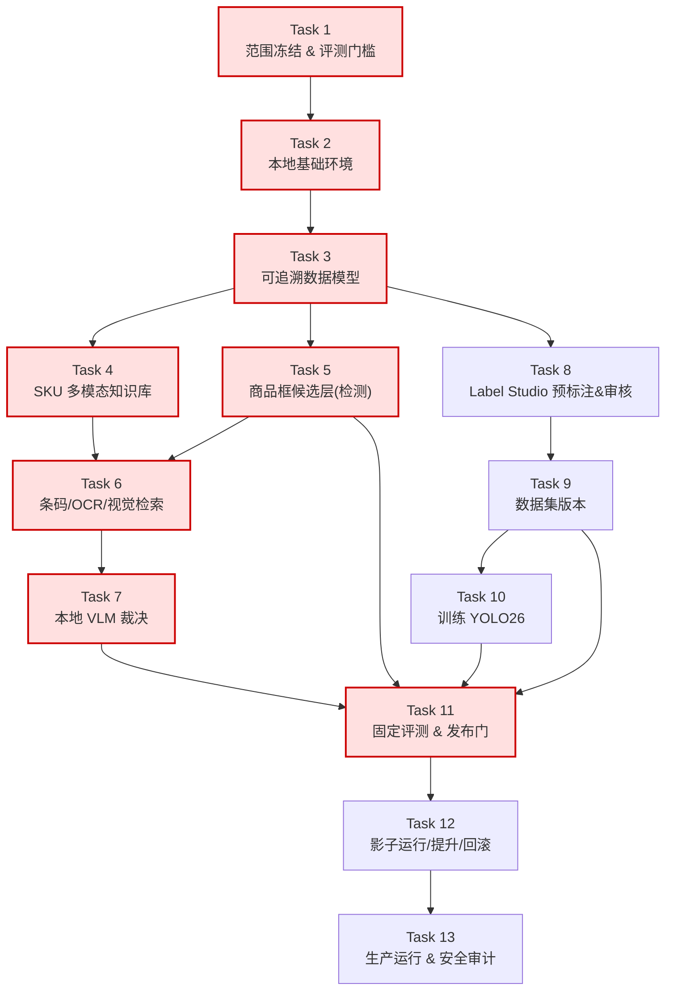

# 实施工作分解结构（WBS）
## 通用 SKU 图像识别系统 · 依赖 / 关键路径 / 工期

| 项目属性 | 内容 |
|---|---|
| 文档版本 | v0.1 |
| 编制日期 | 2026-07-31 |
| 适用团队 | 小团队（2～3 人，串行为主） |
| 关联文档 | `project-charter.md`、`2026-07-31-general-sku-recognition-system.md`（13 个 Task 的详细步骤 therein） |

> 本文档把《技术实施计划》的 13 个 Task 重新组织为**带依赖关系、关键路径和小团队工期**的可执行 WBS。每个 Task 的内部步骤（Step 1～4）仍以原计划为准，本文档不重复，只补充"排期维度"。

---

## 1. 依赖关系图



红色为关键路径节点（见 §2）。

**ASCII 降级视图**（若渲染器不支持 Mermaid）：

```
T1 ─► T2 ─► T3 ─┬─► T4 ──────────────┐
                │                     ▼
                ├─► T5 ──────────────►T6 ─► T7 ──┐
                │                                │
                └─► T8 ─► T9 ─► T10 ────────────►T11 ─► T12 ─► T13
                        ▲                        ▲
                        └────────────────────────┘
关键路径: T1→T2→T3→T4→T6→T7→T11→T12→T13
```

---

## 2. 关键路径分析

**关键路径（决定最短总工期）**：
`T1 → T2 → T3 → T4 → T6 → T7 → T11 → T12 → T13`

含义与启示：
- **知识库（T4）是识别链的咽喉**：条码/OCR/检索（T6）必须等知识库就绪才能做硬过滤和向量召回。T4 延期会直接拖垮 M1。
- **检测（T5）有浮动**：T5 与 T4 可并行推进（T5 只依赖 T3），只要在做 T6 前产出商品框即可。小团队可把 T5 稍微后移，先保 T4。
- **Label Studio（T8）与识别链解耦**：T8 只依赖数据模型（T3），可在 M1 期间与 T5–T7 **并行**开发，是小团队唯一值得并行的支线。
- **评测（T11）是多路汇聚点**：检测、VLM、数据集、训练四者都要喂给 T11，它是 M1/M2 的天然检查点。

**资源建议**：若有 2 名工程师，推荐分工 = 甲走关键路径（T4→T6→T7→T11），乙走支线（T5、T8），在 T11 前汇合。

---

## 3. 阶段划分（对齐里程碑）

| 阶段 | 含任务 | 对应里程碑 | 阶段目标 |
|---|---|---|---|
| **A 范围与门槛** | T1 | M0 | 冻结范围、签字、固化门槛 |
| **B 地基** | T2, T3, T4 | M0→M1 | 环境、数据模型、可查询知识库 |
| **C 识别三线** | T5, T6, T7 | M1 | 检测 + 证据融合 + VLM 裁决，金标准评测 |
| **D 人机闭环** | T8, T9, T10 | M2 | 预标注审核、数据版本、YOLO 训练 |
| **E 发布体系** | T11, T12 | M2→M3 | 评测门、影子运行、回滚 |
| **F 生产** | T13 | M3 | 生产 API、只读审计、运维 |

---

## 4. 任务明细（排期维度）

> 工期单位为**人周（person-week, pw）**，按单人全职投入估算；"小团队串行工期"见 §5。负责角色沿用章程 §6。

### 阶段 A — 范围与门槛（M0）

| 任务 | 前置 | 工期 | 负责角色 | 交付物 | 验收标准 |
|---|---|---|---|---|---|
| **T1** 冻结范围与评测协议 | — | 1 pw | 项目负责人 + 业务 Owner | `scope-and-success.md`、`annotation-guide.md`、`gates.yaml`、契约测试 | 业务负责人签字；两组门槛通过契约测试；人工终审责任人确定 |

### 阶段 B — 地基（M0→M1）

| 任务 | 前置 | 工期 | 负责角色 | 交付物 | 验收标准 |
|---|---|---|---|---|---|
| **T2** 本地基础环境 | T1 | 1.5 pw | 后端/MLOps | `compose.yaml`、`.env.example`、健康检查、集成测试 | 四服务 healthy；密钥仅环境变量注入；集成测试通过 |
| **T3** 可追溯数据模型 | T2 | 2 pw | 后端/MLOps | `catalog/feedback/release models`、迁移脚本、追加式约束测试 | 13 个核心实体建好；`review_event` 禁更新/删除，测试验证 |
| **T4** SKU 多模态知识库 | T3 | 3 pw | 商品知识负责人 + CV | 导入器、校验器、向量嵌入、pgvector、demo 种子脚本 | 条码冲突/规格缺失/包装重叠/孤立图被阻止发布；Top-K 向量召回可用 |

### 阶段 C — 识别三线（M1）⚠️ 小团队建议串行 T4→T6→T7，T5 可与之并行

| 任务 | 前置 | 工期 | 负责角色 | 交付物 | 验收标准 |
|---|---|---|---|---|---|
| **T5** 商品框候选层 | T3 | 2.5 pw | CV | 三个检测适配器（Grounding DINO / YOLOE / YOLO26）+ 契约测试 | 三适配器同一 `Detection` 契约；坐标限图片范围内 |
| **T6** 条码/OCR/视觉检索 | T4, T5 | 3 pw | CV | barcode/ocr/search/fusion 模块 + 融合测试 | 条码唯一命中优先；硬冲突不被视觉相似度覆盖；冲突进人工 |
| **T7** 本地 VLM 裁决 | T6 | 3 pw | CV + 后端 | prompt/vlm/schema 模块、`decision_rules.yaml`、schema 契约测试 | 输出结构化裁决；非法 SKU/缺证据/非 JSON 进人工；模型不得自批 |
| **（M1 评测）** 金标准基线评测 | T5–T7 | 1 pw | CV + 标注负责人 | 500 张金标准评测报告（三路线对比） | Top-5≥95% 且未知错误接纳率≤3%，否则停止扩建（见停止条件） |

### 阶段 D — 人机闭环（M2）

| 任务 | 前置 | 工期 | 负责角色 | 交付物 | 验收标准 |
|---|---|---|---|---|---|
| **T8** Label Studio 预标注与审核 | T3（可与 C 并行） | 3 pw | 后端/MLOps | label_config.xml、ml_backend、converter、webhook、往返测试 | prediction 带版本与分数；人工修改产生新 review_event，原预测不覆盖 |
| **T9** 数据集版本 | T8 | 2.5 pw | CV + 标注负责人 | builder/splitter/export_yolo、金标准脚本、泄漏测试 | 仅用人工确认标签；按批次分组切分；金标准零泄漏 |
| **T10** 训练 YOLO26 并登记 | T9 | 2.5 pw | CV | yolo_trainer、registry、训练脚本、冒烟训练 | 记录代码/数据/参数/种子/权重哈希；冒烟训练生成未发布 model_version |

### 阶段 E — 发布体系（M2→M3）

| 任务 | 前置 | 工期 | 负责角色 | 交付物 | 验收标准 |
|---|---|---|---|---|---|
| **T11** 固定评测与发布门 | T5, T7, T9, T10 | 3 pw | CV + 后端 | metrics/slices/gate、评测脚本、发布门回归测试 | 分组指标输出；任一硬门槛失败即阻止发布，生产模型不变 |
| **T12** 影子运行/提升/回滚 | T11 | 3 pw | 后端/MLOps | shadow/promote/rollback、`release-policy.md`、回滚测试 | 影子不影响业务；提升记录全版本；一键回滚后历史完整 |

### 阶段 F — 生产（M3）

| 任务 | 前置 | 工期 | 负责角色 | 交付物 | 验收标准 |
|---|---|---|---|---|---|
| **T13** 生产运行与安全审计 | T12 | 3 pw | 后端/MLOps + 安全 | API、auth、recognize/audit 路由、`operations-runbook.md`、权限测试 | 识别只新增不覆盖；审计只读；越权/重放/超时/模型不可用均被处理 |

**人周合计**：约 **33 人周**（不含 M3 真实流量影子运行的等待日历时间）。

---

## 5. 小团队修订工期（重点）

原《技术实施计划》的工期按完整团队、可并行估算。**对 2～3 人小团队，做如下诚实修订：**

| 里程碑 | 原计划工期 | 小团队修订工期 | 修订理由 |
|---|---|---|---|
| **M0** 范围冻结 | 1 周 | **1～2 周** | 数据已有，但需业务签字 + 金标准协议 + 基线测量 |
| **M1** 技术验证 | 2～4 周 | **5～8 周** | 识别三线由并行改串行；一人难同时推进检测/检索/VLM |
| **M2** MVP 闭环 | 6～10 周 | **12～18 周** | 人周合计 ~33pw，小团队日历时间被拉长；T8 可并行回收部分 |
| **M3** 受控试点 | 3～6 月 | **3～6 月** | 主要由真实流量与评测轮次决定，与团队规模关系较小 |
| **M4** 生产扩展 | 6～12 月+ | **6～12 月+** | 同上 |

**到受控试点（M3 开始）的总日历时间：约 5～8 个月**（原计划隐含约 3～5 个月）。

### 5.1 给小团队的三条取舍建议

1. **识别三线不要同时开**：先打通"T4 知识库 → T6 检索+硬规则 → T7 VLM"这条最可能达标的主链（它不依赖 YOLO 训练），拿到金标准评测结果后，再决定是否投入 T10 的 YOLO 训练。YOLO 是为了提速/降本，不是技术验证的必要条件。
2. **T8（Label Studio）尽早并行**：它只依赖 T3，是支线里 ROI 最高的，可以让一名工程师在 M1 期间就启动，避免 M2 拥堵。
3. **MVP 可以先砍掉"训练闭环"**：若工期吃紧，M2 可先交付"预标注 + 人工审核 + 评测门 + 影子运行"，把 T10（YOLO 训练）作为 M2.5 增量。人工审核闭环本身就能产生业务价值。

---

## 6. 首次执行顺序（小团队版）

1. **T1** 完成并业务签字（硬前置，不可跳过）。
2. **T2 → T3 → T4** 顺序打通地基与知识库（关键路径）。
3. **T5 与 T8 并行启动**（两人时）：一人做检测，一人做 Label Studio。
4. **T6 → T7** 打通识别主链，立即跑 **M1 金标准评测**。
5. 评测达标后，**T9 → T10** 建立训练闭环。
6. **T11 → T12 → T13** 作为任何试点的硬前置，不以演示版本替代。

---

## 7. 进度监控建议

- 以**双周迭代**为单位排期，每迭代锁定 1～2 个任务。
- 每迭代更新：任务完成度、关键路径是否受阻、门槛接近度（用已有数据先跑局部评测）。
- 关键路径任务（T4、T6、T7、T11）设预警：任何一项预计延期 > 1 周，立即升级评审。
- 用本报告 §3 阶段表作为迭代规划的对照基准。
