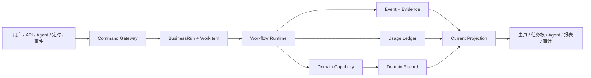

# 统一 Work / Event / Usage 控制平面

## 1. 目标

任何模块、Agent、模型或人工操作都必须回答六个问题：谁为哪个客户/项目发起了什么工作、现在运行到哪里、下一步由谁处理、用了哪些数据和证据、消耗了多少资源、最终产生了什么业务结果。

## 2. 统一主链

`Domain Record` 是业务事实，例如问卷答案、识别结果或结算单；`WorkItemProjection` 是可重建的当前状态，不得反向成为业务真值。

## 3. 核心对象

### BusinessRunV1

必需字段：

- `run_id`, `work_id`, `tenant_id`, `customer_id`, `project_id`；
- `workflow_definition_id`, `workflow_version`, `trigger_type`；
- `parent_run_id`, `correlation_id`, `causation_id`；
- `subject_type`, `subject_id`, `initiator_type`, `initiator_id`；
- `status`, `current_node`, `started_at`, `ended_at`, `version`；
- `evidence_bundle_id`, `usage_account_id`, `policy_snapshot_id`。

### WorkItemV2

用于人的统一待办与 Agent 的工作队列：

- 归属：tenant/customer/project/workflow/run；
- 当前态：todo/running/waiting/approval/blocked/done/cancelled；
- 所有者：human/role/agent/team；
- `title`, `business_summary`, `next_actions`, `due_at`, `sla_policy`；
- `subject`, `parent_work_id`, `dependencies`, `blockers`；
- `evidence_refs`, `usage_refs`, `result_ref`；
- 乐观锁 version 与幂等键。

旧 `review_task_v1`、`recognition_task`、training cycle、agent command 保留为域记录或历史事件，但 current UI 统一投影为 WorkItemV2。

### EventEnvelopeV1

- `event_id`, `event_type`, `event_version`, `occurred_at`；
- tenant/customer/project；actor type/id；
- correlation/causation/run/work/subject；
- `payload_schema`, `payload`, `evidence_refs`, `idempotency_key`；
- append-only，修改用 supersedes/correction event。

采用 Transactional Outbox：业务记录、事件和 outbox 在同一事务提交；异步处理至少一次投递，消费者以幂等键去重。

### UsageEventV2

- tenant/customer/project/contract/rate-card；
- run/work/node/capability/model/profile/tier；
- unit、quantity、resource_cost、internal_cost、customer_price、currency；
- source evidence、meter version、price version、occurred_at；
- append-only；冲正使用 reversal/adjustment，不 UPDATE 历史金额。

建议单位：`recognition_photo`、`recognition_region`、`model_compute_ms`、`agent_input_token`、`agent_output_token`、`workflow_node_execution`、`survey_response`、`field_visit`、`travel_km`、`report_generation`。

### EvidenceBundleV1

证据不是字符串数组，应包括：来源 URI/CAS hash、内容类型、生成者、生成时间、输入 hash、配置/模型/代码版本、权限标签、保留期和父证据。

## 4. 状态机

统一运行状态必须显式且可恢复：

`draft → queued → running → waiting_human/waiting_external/waiting_timer → running → succeeded/partially_succeeded/failed/cancelled`

规则：

- 失败不能直接变成功，必须由 retry/resume/compensation 新事件推动；
- 人工批准和人工修改是节点，不是数据库旁路；
- 超时、重试、死信、取消、补偿均有事件；
- 任务详情显示“为什么停在这里”和“谁可以执行下一动作”。

## 5. 唯一事实源与投影

1. `BusinessRun + Domain Record + Event + Usage` 是事实；
2. `WorkItemProjectionV2` 是唯一 current task 投影；
3. 首页、主管、任务板、模块待办、通知全部查询相同投影 API；
4. 旧 WorkItems 与 Taskboard API 先兼容映射，完成消费者迁移后 deprecated；
5. 投影可清空重建，并通过 event count/hash 对账；
6. superseded 历史永不进入 current 计数。

## 6. 模块接入契约

每个 Domain Pack 必须提供：

- `ModuleManifestV3`；
- command/query/event 的版本化 JSON Schema；
- Capability Adapter 与健康检查；
- 权限 scope、数据 scope 和最小角色；
- billing meter 与 rate-card key；
- UI routes/slots 的受控组件 key；
- WorkItem 投影规则、证据策略、保留策略；
- migration、API、SDK、测试、操作手册。

注册时交叉验证：声明但无 adapter、adapter 无 schema、计费单位无 meter、route 无组件、Agent 无权限、依赖缺失均 fail-closed。

## 7. 主管 Agent 的正确位置

主管 Agent 不直接修改业务表。它只能：

1. 查询 current projection 和授权的数据产品；
2. 形成计划草稿与 Workflow Draft；
3. 委派已注册领域 Agent/Capability；
4. 给出成本、权限和影响预览；
5. 请求人工批准；
6. 追踪 run/node/work/event；
7. 在失败、超时或异常时生成升级 WorkItem；
8. 总结结果并写入分级记忆。

所有工具调用必须由 Policy Engine 校验 tenant/customer/project、RBAC/ABAC、预算、速率、数据保留和人工门禁。
