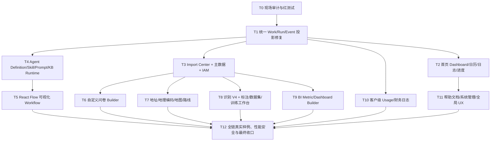

# 连续实施图、门禁与验收

## 1. 连续执行原则

实施 Agent 从 T0 连续工作到 T12，不在每个阶段请求用户确认。每完成一个任务：红测试→最小实现→局部测试→回归→浏览器验收→证据→小步 commit→更新清单和日志，然后自动进入下一任务。

门失败时执行内部 Loop：

```text
reproduce → classify root cause → add red test → fix → verify
→ reconcile DB/API/UI/Agent → update evidence → retry gate
```

同一根因连续三轮无法关闭，或需要 Secret/外部账号、真实重训练、数据删除、远程部署时才标记 BLOCKED 并继续完成其他不依赖任务。不得用“等待确认”暂停整个工程。

## 2. 任务依赖图



无依赖冲突的 T3/T4、T6/T7/T8/T9/T10 可在代码层并行调查，但所有数据库迁移和共享 Registry 改动必须串行合并并实时复核。

## 3. Gate

### G0：安全基线

- 读取全局路由、Codex 手册、本目录和旧 V2 治理；
- 记录 HEAD/branch/worktree、服务、进程、DB integrity/schema/migrations、production、模型进程；
- 备份 SQLite；受保护未跟踪资产不暂存、不改动；
- 不启动长训练、不删除历史、不 merge/push/deploy；
- 对 14 项用户问题和本目录 P0/P1 建 red contract/browser tests。

### G1：统一状态

- `workflow.succeeded/failed/cancelled/waiting_human` 与 run 事件语义统一；
- 事件重建后 Run/WorkItem/API/UI 完全一致；
- 首页、Taskboard、Supervisor、Calendar、Project Progress 消费同一 current projection；
- succeeded 清除 current_error，但旧 attempt 可查；
- BI 版本列表正确；
- 旧 250 只在 history。

### G2：首页可运营

- 首页八类卡片全部真实、可点击、空态诚实；
- 创建日程、快速目标和人工待办后刷新不丢；
- 主管工作台四视口不遮挡；
- 从首页可进入任意当前事项并返回。

### G3：主数据/IAM/导入

- 至少 13 套 CSV/XLSX 模板可下载；
- dry-run/错误报告/提交/幂等/证据完整；
- 用户可以创建角色、权限、客户、项目、SKU、员工和地址；
- 多客户授权正确，越权 403；最后管理员保护有效。

### G4：Agent 与 Workflow 真运行

- 至少 Supervisor、ModelOps、Data Steward、Survey、Analytics、Field、Finance 七个 Agent 有真实 Definition 和 health probe；
- soul/prompt/tool/skill/KB/model/memory/approval 可视化配置和版本回滚；
- Supervisor 完成至少 8 个真实工具意图，不再用统一 `ok=true`；
- React Flow 画布保存 canonical graph；
- wait/parallel/join/loop/approval/agent/model/capability/subflow 有真实运行测试；
- 进程重启后 timer/checkpoint 恢复。

### G5：Domain Workbench

- 从空白建立并发布问卷；
- 导入地址、地理编码、地图展示、规则和路线；
- V4 best 默认识别真实运行，experimental profiles 真实加载/阻断；
- Label Studio、数据集、训练、模型、发布控制面入口贯通；
- BI 创建指标、计算字段、图表、Dashboard、异常追问；
- Usage 按客户/项目/类型下钻和导出。

### G6：真实用户路径

完整执行 `05-REAL-DATA-END-TO-END-UAT.md` 的机器预演：同一客户/项目从导入到报表/Usage 的 ID、状态、权限、证据一致。任何 fixture 必须标明 fixture，不能把固定数据库种子当用户操作通过。

### G7：质量、安全和性能

- hermetic、host_mps、前端 typecheck/build 全通过；
- 浏览器覆盖 1440/1280/1024/768，console error=0；
- 无断链、不可用按钮、假图表、重复版本和无法返回的抽屉；
- session/CSRF/SSRF/IDOR/prompt injection/任意 SQL/命令注入测试；
- rate limit 覆盖登录、Agent、URL、导入、识别和高成本查询；
- 首页/API p95、长列表分页、任务吞吐、资源使用有真实报告；
- 服务 stop/start/restart/doctor 和运行恢复通过。

### G8：文档和最终 Gate

- 用户手册以角色和任务组织；
- Import Template Reference、Agent/Workflow How-to、API Reference、故障手册可从 UI 搜索；
- STATUS/ISSUES/DECISIONS/LIST/LOG 与 HEAD/DB/API/UI 一致；
- 只有无 P0/P1 且 G0–G8 全过，写 `READY_FOR_REAL_DATA_UAT`。

## 4. 验收反例

以下均不能算完成：

- 只添加导航或空页面；
- 只建立表，没有用户 CRUD；
- 只建立 API，没有前端和 Agent command；
- 只写 fake backend 测试；
- 用固定 seed/fixture 代替用户从空白创建；
- 画布只是 JSON textarea；
- 模型卡显示 enabled，但实际不能加载；
- Agent health 只检查 Manifest 是否存在；
- 地图用静态图片；
- BI 用固定数字或静态图；
- 导入直接修改 SQLite；
- 失败后显示成功空结果；
- 用测试数量代替浏览器 E2E 和数据对账。

## 5. 本轮授权边界

已授权：代码/测试/文档/迁移、本机服务重启、现有模型加载测试、本机 V4 best 受控切换、smoke/preflight、创建演示 fixture 和导入模板。

未授权：真实长时间重训练、删除历史/客户资产、远程部署、merge/push、购买服务、提交外部客户数据、绕过 Secret 配置、自动发布弱模型为商业 production。

