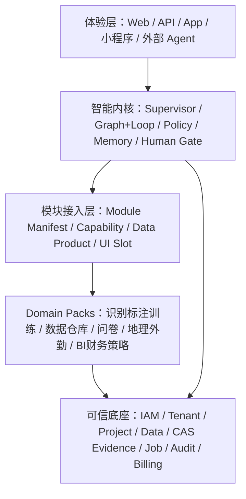

# 产品定位与统一平台架构

## 一、产品定义

系统正式定义为：

> 一套以 Graph+Loop 为智能执行内核、以模块化 Domain Pack 为业务能力、以共享数据与证据底座为可信事实源、由主管 Agent 和领域 Agent 协作完成工作的智能业务操作系统。

识别不是中心。识别、标注、训练只是第一个已实现的行业 Domain Pack，用于验证通用底座。未来数据仓库、问卷、地址与地理、路线规划、电子围栏、BI、告警、数据深度对话、财务对账、策略分析都必须以相同契约接入。

## 二、采用的实施策略

比较三种方案：

1. 仅做 UI 美化：成本最低，但继续保留并行注册表和假三级菜单，不能解决根因；拒绝。
2. 重写一个大而全的新前后端：视觉统一，但会破坏已有识别、审核和训练资产，风险过高；拒绝。
3. **推荐：统一平台壳层 + Manifest 驱动 + 识别纵向切片**。保留已有领域能力，通过适配器迁移到一个模块/Agent/API/数据契约；先把工作台和识别首域做实，再让未来模块按同一契约插入。

本任务书采用方案 3。

## 三、五层架构

### 3.1 体验层

- 一个 Web App Shell；模块页面是专业操作面，不是业务规则事实源。
- Web、API、Agent、未来 App/小程序调用同一领域服务。
- 首页以目标、待办、异常和当前运行状态为中心，而不是模块宣传页。

### 3.2 智能内核

- Supervisor 负责目标理解、任务分解、选择领域 Agent、汇总证据和请求审批。
- Graph 定义流程；Loop 负责观察、判断、重试、反馈和终止。
- 每次调用受权限、预算、token、时间、数据范围和人工门限制。
- LLM 上下文不是事实源；状态必须在 Run/Checkpoint/Blackboard/Memory 中持久化。

### 3.3 模块接入层

唯一 `ModuleManifestV2` 至少声明：

- `module_id/name/version/domain/status`；
- 一级导航、二级路由、三级动作和模块色系 token；
- 领域 Agent、capability scopes、command schemas；
- API prefix、OpenAPI tags、events、data products；
- UI slots、feature flags、permission scopes；
- dependencies、compatibility、health checks；
- billing units、audit policy、retention policy。

前端导航、模块目录、Agent Registry 和 API 文档都从同一注册投影读取。任何字段不合法、依赖缺失或版本不兼容都 fail-closed，不显示伪“live”。

### 3.4 Domain Pack

每个业务包拥有自己的领域模型、服务、迁移、图模板、Agent、页面和测试，但不得：

- 复制身份、项目、权限、资产、证据、任务、审计、计费和 Agent Runtime；
- 直接写其他领域 schema；
- 在平台内核写 FMCG、问卷或地理特例；
- 让页面或 Agent 绕过领域服务直接写库。

### 3.5 可信底座

本地开发阶段允许 SQLite + 本机 CAS，但接口必须遵循未来 PostgreSQL/S3 迁移边界：

- 数据库连接只经 repository/unit-of-work；
- 大文件只在 CAS/Object Storage，数据库保存引用和 hash；
- 事件与任务有 idempotency、outbox/inbox、retry/dead-letter；
- tenant/customer/project/scope 字段从第一版保留；
- append-only 审计与证据不可被 UI 或 Agent 覆盖。

## 四、模块目录规划

第一阶段一级模块建议：

1. 首页 / 主管工作台；
2. 数据与资产；
3. 调研与问卷；
4. 位置与外勤；
5. 智能识别；
6. 分析与 BI；
7. 工作流与 Agent；
8. 财务与结算；
9. 系统与开发者。

识别域内部包含标注、数据集、训练、模型和识别任务，不再把这些都提升为全平台一级模块。系统可根据租户权限隐藏未购买或未启用模块，但不是删除代码。

## 五、状态与成熟度语义

模块必须使用统一状态：

- `live`：真实后端、权限、数据、测试和操作入口已通过；
- `beta`：可运行但存在已披露限制；
- `planned`：只有规格和插槽，不展示假指标、不允许操作；
- `degraded`：已启用但依赖服务异常；
- `disabled`：被策略、权限或管理员关闭。

页面必须显示“能做什么、不能做什么、下一步是什么”，禁止用“建设中”卡片掩盖断链。

## 六、架构完成门

- 前后端不再各自硬编码模块清单；
- Module Manifest、Agent Manifest、Capability、Navigation、API 和 Feature Flag 可交叉验证；
- 新增一个 `reference.echo` 示例模块，不改 App 主路由和数据库核心表即可被发现、显示、调用和卸载；
- 用识别 Domain Pack 和非识别 reference module 双重证明内核不绑 FMCG；
- 关闭某一 Domain Pack 后，其历史 Run、证据和账本仍可查询，其它模块不受影响。
