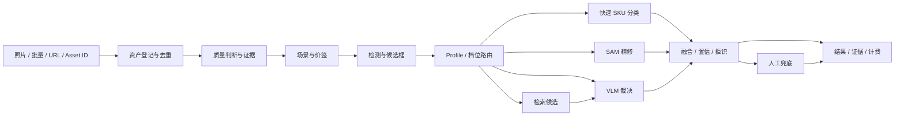

# 识别首域端到端打通方案

## 一、目标

在不重新训练、不自动切换 production 的前提下，让现有最好生产模型通过统一 Domain Pack 正常工作，并使同一个识别任务可由 Web、API、Supervisor/Recognition Agent 三个入口发起、查询和审计。

## 二、统一识别 Graph

每个节点都是 Capability；Graph 不直接引用权重路径。现有 8091 legacy production 通过适配器提供 `production_legacy`，后续新模型只新增 Profile/Capability 版本。

## 三、Recognition Profile 契约

识别请求必须包含：

- `recognition_profile_id`；
- `service_tier`；
- `source`（web/api/agent/internal）；
- `project_id/customer_id`；
- `idempotency_key`；
- 输入引用（upload/url/asset_id）；
- 可选质量/延迟/成本偏好。

服务端解析已注册 Profile，返回冻结后的：

- graph_version；
- component versions；
- thresholds/policy version；
- cost estimate/SLA；
- allowed/blocked reason；
- production/shadow/experimental 标记。

前端选择的 Profile 必须进入请求、任务行、Run、结果和证据；响应必须回显。结构上禁止传任意 `.pt`、adapter 路径或未注册模型 ID。

## 四、三种入口必须同源

### Web

- 即时单图、批量、URL、历史分别拥有真实二级路由；
- 选择 Profile、档位和输入后创建统一 RecognitionTask；
- 即时单图也进入任务历史；
- 结果页展示原图、方框、SKU、置信、拒识/人工、场景、质量、耗时和费用；
- 可下载 JSON/CSV/标注图，证据抽屉展示模型、阈值、Graph trail。

### API

- `POST /api/v1/vision/recognition-tasks` 创建任务；
- `GET /api/v1/vision/recognition-tasks/{id}` 查询；
- `GET /api/v1/vision/recognition-tasks/{id}/events` 查看进度；
- `GET /api/v1/vision/recognition-tasks/{id}/evidence` 查看证据；
- `POST .../{id}/cancel` 仅对可取消状态生效；
- OpenAPI、错误码、幂等、限流、最大文件数和 URL 安全规则完整。

旧 `/api/v1/recognition/*` 保留兼容，内部转到同一 Domain Service，并在响应标记 deprecation；禁止两套结果逻辑长期并行。

### Agent

用户说“用生产模型识别这批照片”“用高精度档重跑任务 X”时：

1. Supervisor 检查权限和输入；
2. 调用 Recognition Agent 生成命令预览；
3. 展示 Profile、预计时间/费用和数据范围；
4. 用户批准后调用同一创建任务 API；
5. UIIntent 打开任务详情；
6. 完成后 Agent 汇总结果并引用证据。

## 五、必须修复的现有断点

- Profile local state 不得继续成为虚假控件；
- 旧 bundle 文案必须改为 API 实时值；
- `/cascade` 与 `/recognition` 合并为同一识别域信息架构，旧页只作兼容重定向；
- 单文件、批量、URL、API、Agent 全部写同一任务表；
- 结果框坐标必须声明坐标空间并按 EXIF/缩放正确映射；
- 0 检出、模型不可用、服务过载、URL 下载失败、质量拒绝均使用明确错误/拒识状态；
- 每次结果保存 asset/version/profile/graph/model/policy/threshold/registry/evidence hash；
- 8091、8400、Graph 和 Web 的 production ID 必须来自同一运行态，不得硬编码。

## 六、可演示完成门

使用仓库内合法样板照片建立 `demo_recognition_acceptance_v1`，不得进入训练或金标准：

1. 冷启动后四服务健康；
2. Web 登录；
3. 选 `production_legacy` 上传一张货架图；
4. 获得叠框结果或诚实的 0 检出；
5. 任务历史出现相同 task/profile/result；
6. API 用同一资产和幂等键重放得到同一任务；
7. Agent 创建另一条任务并自动打开详情；
8. 结果证据包含 Graph trail、profile、bundle、模型 hash 和耗时；
9. 禁用 Profile 无法提交，并显示原因；
10. 8091 停止时 Web/API/Agent 都显示同一 degraded 原因，恢复后可重试。

通过这 10 项才允许说“识别模块已打通”。模型准确率是否商业达标仍由独立金标准决定，不能用页面可用代替模型晋级。
