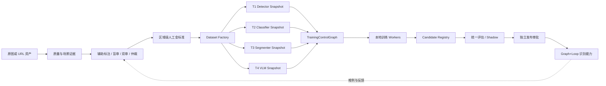
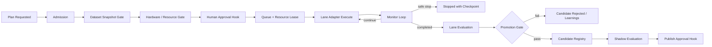

# 四训练通道架构与契约

## 1. 架构原则

系统仍是一套 Graph+Loop 智能底座。标注、过滤、数据集和训练是独立模块，通过 Capability、DomainCommand、事件、ResourceRef 和特殊 Hook 接入同一主线；前端只是控制投影，不能直接拼 shell 命令或启动进程。



## 2. 旧模型与新 lineage 隔离

### 2.1 旧模型保留策略

不移动、不重命名、不删除任何现有 `.models/`、`best/` 或 bundle 文件。为它们追加逻辑登记：

| 状态 | 允许用途 |
|---|---|
| `production_legacy` | 当前在线识别、assisted proposal、基线评估 |
| `historical` | 只读复盘与同口径基线 |
| `experimental_ended` | 只读评估，不发布、不续训 |
| `quarantined` | 证据保留，任何运行/训练入口拒绝 |

当前 `prod_20260805_v5_r1` 作为 `LegacyInferenceCapability` 接入 Graph+Loop，继续服务当前识别；它不是新训练的父 checkpoint。

### 2.2 新 lineage

新训练族固定为 `fmcg_nextgen_v1`，至少包含：

```text
lineage_family
training_lane
base_model_source
base_model_revision
parent_artifact_id
proposal_teacher_bundle
dataset_snapshot_id
code_commit
config_hash
run_id
artifact_sha256
```

门禁规则：

1. `parent_artifact_id` 只能指向批准的 public/foundation base。
2. `.models/sku_*`、旧 classifier、E2 和生产 bundle 的权重不得作为 parent、resume、optimizer state、EMA 或蒸馏 teacher。
3. `proposal_teacher_bundle=prod_20260805_v5_r1` 只允许生成 provisional proposal；人工修订并达成终态后，标签才可能进入 Dataset Factory。
4. 新制品写入全新不可覆盖命名空间；任何目标目录已存在均 fail-closed。
5. 旧模型与新模型只能在统一冻结评估集上对比，不能混淆不同 val 口径。

## 3. 统一资产、标签与数据集契约

### 3.1 唯一身份

任何样本都以 `asset_id + photo_sha256 + region_id` 绑定；photo_id 只作业务别名，不得通过独立排序或位置 zip 恢复 SHA。SKU 语义固定走：

```text
dataset_class
  -> canonical_sku_id
  -> package_version_id
  -> registry_version
```

展示名不能作为训练目标的唯一身份。

### 3.2 共同准入条件

正式训练样本至少满足：

- active queue，非 rq_v1、非 invalidated；
- `human_final` 或 `gold_verified`；
- 质量状态符合该训练通道策略；
- 非 active protocol/frozen holdout；
- client/store/session/SHA/near-duplicate/时间泄漏守卫通过；
- 原图、标签、registry、审核事件和证据引用都可解析；
- unknown/new_package 不被强行改成已有 SKU；
- builder 只从事实源读取，不接受客户端自由 JSON 冒充审核结论。

### 3.3 四个 DatasetSnapshot

#### D1 DetectorDatasetSnapshot

- 输入：原图、所有可见商品的真实框、质量/场景证据。
- 目标：`product` 类的定位与计数；已知 SKU、未知商品、新包装都可作为 product 框。
- 必须包含：空货架/背景硬负样本、拥挤/小目标/遮挡分桶。
- 关键门：框完整率、漏标率、one-to-one truebox、固定 FP/image。

#### D2 ClassifierDatasetSnapshot

- 输入：tight box crop、mask crop、context crop、canonical SKU、package version、unknown 与近邻难负样本。
- split 按原始照片、门店、session、客户和包装版本成组，任何派生 crop 都继承原图 split。
- 关键门：每类最小样本、长尾分布、unknown 覆盖、包装版本和展示名映射完整。

#### D3 SegmenterDatasetSnapshot

- 输入：原图、point/box prompt、实例 mask、tight box、遮挡/截断属性。
- 只有真实 mask gold 可用于权重微调；只有 bbox 的样本只能用于 prompt/阈值/裁剪策略校准。
- 关键门：mask IoU/Boundary F-score、相邻商品粘连、边界触碰、漏实例、人工 mask 完成率。

#### D4 VlmDatasetSnapshot

- 输入：原始大图、目标区域坐标、区域 crop、context crop、OCR/属性、真实 CandidateSet、canonical target 或 unknown/new_package。
- 输出 MLX-VLM 当前版本实际支持的数据格式；不手写错误的 `<|vision_start|>` 模板。
- CandidateSet 构建函数签名不得接受 GT；不足 k 个候选不能补真值。
- 第一轮 5,000–20,000 instance、1 epoch、rank16、vision frozen，增加规模需新实验批准。

### 3.4 数据复用方式

四个快照可以引用同一原图和同一人工审核事实，但必须拥有独立 manifest、builder version、schema version、split report、quality histogram 和 manifest hash。优先使用 ResourceRef/CAS，避免复制 8T 硬盘上的大图；派生 crop/mask 仍需内容哈希和父资源引用。

## 4. 照片过滤与证据链

统一过滤图不是简单的 pass/reject：

```text
ingest
 -> SHA/重复与来源验证
 -> 技术质量(模糊/倾斜/反光/翻拍/截断)
 -> 业务可用性(大头照/非货架/无商品/场景)
 -> 四级结论(accept/warn/manual_review/reject)
 -> 误拒绝抽检/人工复核
 -> 按训练通道的可用性投影
```

每个判定保存 analyzer 版本、原始分数、阈值版本、裁剪/缩略图证据、结论、人工覆盖和覆盖原因。`reflection=0` 或某项长期全零必须触发 analyzer coverage 告警，不能解释为数据没有问题。严重照片可从某个训练通道排除，但原始资产和证据永远保留。

## 5. 标注与 proposal 接入

1. Label Studio 项目 19 是 assisted，允许追加当前生产 bundle 的 proposal。
2. 项目 20 是 blind，prediction、模型字段、候选排序和 proposal 元数据必须始终为零。
3. proposal 包含 box、建议 canonical SKU、置信/拒识状态、model bundle、输入 SHA 和 evidence_id；不能写成 annotation 或 human_final。
4. 当前模型无检出时任务仍存在，显示“无建议，请人工检查漏标”，不能把零框当成无商品真值。
5. SAM 可用于 proposal 几何精修，但 mask/box 仍是 provisional；人工才产生终态。
6. proposal 回填必须 append-only、幂等、有 dry-run 报告、旧 prediction 不覆盖。

## 6. TrainingControlGraph

四条通道共享同一控制图，通道差异由 adapter 和 policy 注入，禁止复制四套训练系统。



### 6.1 必须实现的 Hook

- `HOOK_DATASET_READY`
- `HOOK_LABEL_GOLD_READY`
- `HOOK_APPLE_RESOURCE_READY`
- `HOOK_TRAINING_APPROVAL_REQUIRED`
- `HOOK_RUN_STARTED`
- `HOOK_RUN_PROGRESS`
- `HOOK_STOP_LINE_TRIGGERED`
- `HOOK_RUN_FAILED`
- `HOOK_EVALUATION_READY`
- `HOOK_REGRESSION_BLOCKED`
- `HOOK_SHADOW_READY`
- `HOOK_PUBLISH_APPROVAL_REQUIRED`
- `HOOK_HUMAN_REVIEW_REQUIRED`

Hook 只能推进合法状态，不能绕过状态机。Agent 可以建议计划、解释阻断、触发经授权的 DomainCommand，但不能直接写数据库、拼任意 shell 或自行批准训练/发布。

## 7. 训练运行契约

建议新增/扩展版本化契约：

- `TrainingLane`: detector/classifier/segmenter/vlm
- `TrainingPlanV2`: lane、snapshot、base、config、预算、停止线、授权状态
- `TrainingRunV2`: plan hash、状态、worker、pid、lease、heartbeat、progress、exit semantics
- `TrainingEventV1`: append-only 结构化进度与日志引用
- `TrainingArtifactV1`: checkpoint/config/metrics/curves/env/data/code hashes
- `ResourceLeaseV1`: mps/mlx/cpu/io/model-server 的排他或共享租约
- `EvaluationReportV2`: 通道指标、切片、错误账本、成本与晋级结论

状态至少包括：

```text
DRAFT -> BLOCKED | READY_FOR_APPROVAL -> APPROVED -> QUEUED
-> STARTING -> RUNNING -> STOPPING -> STOPPED | FAILED | COMPLETED
-> EVALUATING -> CANDIDATE_REJECTED | CANDIDATE_READY
-> SHADOW -> PUBLISH_REQUESTED -> PUBLISHED | PUBLISH_REJECTED
```

`cancelled` 不能代表已经杀死进程；安全停止必须有 signal、checkpoint、进程退出和 lease 释放证据。

## 8. Apple Silicon 资源策略

- 本机初期只允许一个 heavy accelerator lease；YOLO/ResNet/SAM 的 PyTorch MPS 与 Qwen MLX 训练互斥。
- 在线 8091/8400/8300 的健康和内存保护优先于训练。
- G0 必须在真正执行训练的普通 Terminal/Worker 环境重新跑，mock 仅用于测试。
- 监控内存、swap、温度/thermal state、磁盘、MPS/MLX 错误、NaN/Inf、吞吐和服务 p95。
- 达到 stop line 时先请求训练框架保存 checkpoint 并退出；超时才升级终止策略，所有动作写审计。
- Qwen 使用独立 `.venv_mlx_vlm`，Ollama 量化推理制品不能作为 QLoRA 基础权重。

## 9. 统一 Web 控制台

### 9.1 顶部总览

同时显示且视觉隔离：

- 当前生产：`prod_20260805_v5_r1 / production_legacy / serving`；
- NextGen：四条 lane 的 readiness、blocker、活动 run、最新 candidate；
- 人工金标准、过滤、数据集、资源租约和服务健康；
- 明确声明“当前生产”和“正在训练/待训练”不是同一个 lineage。

### 9.2 四条训练卡片

每条 lane 都有：数据快照、真值完成率、基线来源、Apple 准入、配置、预算、计划、审批、启动、实时进度、日志、曲线、停止、失败原因、制品、评估、对比、shadow、发布请求。

按钮语义：

- `生成计划`：不消耗训练算力；
- `请求批准`：不提交 Job；
- `批准计划`：不提交 Job；
- `启动训练`：只有全部 gate 绿色并二次确认才入队；
- `安全停止`：进入 STOPPING，不能立刻把状态伪写 cancelled；
- `发布`：不在训练页直接执行，只创建独立发布请求。

### 9.3 数据与标注页面

- 数据过滤页：四级质量分布、原因、分析器覆盖、证据、误拒绝抽检、按 lane 可用性。
- 标注页：assisted/blind、proposal 覆盖率、无检出任务、审核进度、冲突/仲裁、gold 产量、直接进入 LS。
- 数据集页：四快照、manifest、split/泄漏、来源、排除账本、样本切片、依赖关系。
- 运行详情：结构化事件流为主，原始日志为证据附件；不再用旧 8092 HTML 作为真实控制状态。

## 10. API 边界

建议按领域暴露，不让前端知道具体训练脚本：

```text
GET  /api/v1/training/lanes
GET  /api/v1/training/lanes/{lane}/readiness
POST /api/v1/training/datasets/{lane}/build
POST /api/v1/training/plans
POST /api/v1/training/plans/{id}/request-approval
POST /api/v1/training/plans/{id}/approve
POST /api/v1/training/plans/{id}/launch
GET  /api/v1/training/runs/{id}
GET  /api/v1/training/runs/{id}/events
POST /api/v1/training/runs/{id}/safe-stop
POST /api/v1/training/runs/{id}/retry
POST /api/v1/training/runs/{id}/evaluate
POST /api/v1/training/candidates/{id}/shadow
POST /api/v1/training/candidates/{id}/request-publish
```

旧 API 通过兼容 adapter 逐步迁移，不能让两套状态同时可写。
