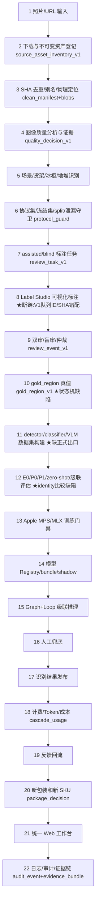

# Project Logic Chain V3 · CURRENT-LOGIC-CHAIN

> 初版（文档基线）；实施过程中用 rg/路由注册/API 调用/DB 写入/浏览器行为逐项复核后更新。

## 并行实现审计表（待逐项现场验证）

| 模块 | 当前入口 | 当前存储 | 是否仍被调用 | 与其他重复 | 定性 | 迁移方式 | 兼容策略 |
|---|---|---|---|---|---|---|---|
| src/labeling（workbench/review_server） | review_server.py（本地 html 页） | 自有 JSON/内存 | 待核 | 与 platform/annotate 重复 | Legacy 候选 | 只读历史入口 | 保留代码不删 |
| src/ls_platform | importer/exporter/orchestrator/webhook | LS API + platform.sqlite 部分 | 部分（M4 PARTIAL） | LS 对接唯一性待定 | 正式候选（LS 适配层） | 收敛为 LS 唯一适配器 | — |
| Label Studio（8300） | 项目 10~13 | LS sqlite | 是 | — | 正式（看图标注） | V2 新建项目 | 旧项目保留 |
| src/platform/annotate | review.py/batches.py/sam_pipeline.py | platform.sqlite（review_task_v1 等） | 是（8400 API） | 与 labeling 重复 | 正式（状态机） | 本轮修复扩展 | — |
| web 统一管理端（8400） | Overview/Assets/Annotation/Training 等 10 页 | 经 8400 API 读 platform.sqlite | 是 | Assets 手输坐标非真实标注 | 正式（工作台） | 接 LS 跳转/regions 提交 | — |
| src/review（human_review_queue） | build_review_queue 脚本 | .review_queue/*.json | 是 | — | 正式（队列构建） | V2 重写构建器 | v1 文件保留 |

## 22 层逻辑链（Mermaid，实施后定稿）

★ = 本轮已确认断链点。
