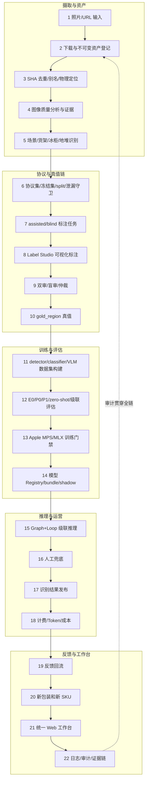

# Project Logic Chain V3 · CURRENT-LOGIC-CHAIN

> 定稿版（commit 12）。所有模块/入口路径均经 ls/rg 现场核对（2026-08-07，HEAD `4a84172`）；
> 无法当场确认的条目标注「待核」。唯一事实源 = `.platform/platform.sqlite`（表结构见
> `src/platform/data/store.py`，migration 001–019）。
> 本轮修复 commit 索引：`41cc93d`（文档基线）、`ea3d69b`/`78b567b`（canonical 身份链）、
> `fa8eec1`（rq_v1 失效 + rq_v2 发布）、`a5d82c7`/`a6bc48a`（统一状态源）、
> `5468423`/`5537af5`（gold 状态机）、`6917e95`/`d306e44`（Label Studio V2）、
> `84512b2`/`6a04bc8`（truebox 导出）、`21fd488`/`ca95e79`（canonical SKU 评估）、
> `d89fc82`（端到端链测试）、`4a84172`（5+5 验收批）。
> S12b 补口：`/api/v1/review/status`、`/api/v1/review/tasks-active`（默认只 active）、
> `/api/v1/review/tasks-history`（失效证据入口）与 `batch_report` 全部收敛到
> `review_progress`/`list_review_tasks_active`：失效 rq_v1 不进默认列表、不阻断批次门禁。

## 〇、每套实现入口审计（职责划分）

| 实现 | 入口（已核对） | 职责定性 |
|---|---|---|
| 统一 Web 工作台（8400） | `src/platform/api/app.py` + `web/src/App.tsx` + `web/src/pages/*`（Overview/Assets/Annotation/Training/CascadeTasks/GraphRuns/ModelRuntime/NewPackaging/Recognition/SystemStatus 共 10 页） | **管理/进度/门禁**。只经 8400 `/api/v1` 读平台库；不承担画框标注 |
| Label Studio（8300） | LS 项目 19 `diag_v2_assisted`（200 任务）/ 20 `diag_v2_blind`（50 任务）；接入层 `src/review/ls_v2_payload.py`、`scripts/create_ls_v2_projects.py` | **看图画框人工提交**。V2 唯一人工画框入口；旧项目 1/10~13 只读保留 |
| platform.sqlite | `.platform/platform.sqlite`（review_task_v1 / review_event_v1 / gold_region_v1 / 队列账本 migration 019 等） | **唯一事实源**。所有状态由 DB 推导（`review_progress`，`src/platform/annotate/review.py`） |
| Graph+Loop | `src/platform/kernel/loop.py`、`src/platform/loops/pipeline_v2.py` | **编排**。节点路由/门禁/feedback 回跳，不存储人工事实 |
| src/labeling（legacy） | `src/labeling/review_server.py`、`workbench.py`、`review.html`、`workbench.html` | **Legacy 只读适配**。保留代码不删，不再产生正式事实 |
| src/ls_platform | `src/ls_platform/{importer,exporter,orchestrator,webhook,ls_client}.py` | LS 适配层（旧链路）；V2 走 `src/review/ls_v2_payload.py`，本层保留兼容，待核是否完全停用 |

## 一、22 层逻辑链总图

## 二、逐层说明

### 1 照片/URL 输入
- 模块/入口：`src/recognize/api.py`、`src/recognize/service.py`、`src/recognize/dashboard.html`（URL/上传识别入口）；`scripts/export_photo_meta.py`（批次照片元数据导出）。
- 当前存储：`recognition_task`（platform.sqlite）+ 资产登记链（见第 2 层）。
- 状态：正式。
- 本轮修复点：无（上游入口层，本轮未涉断链）。

### 2 下载与不可变资产登记
- 模块/入口：`src/platform/assets/ledger.py`（U3-2 建账）、`src/platform/assets/inventory.py`、`src/platform/api/assets.py`（Asset API）。
- 当前存储：`source_asset_inventory_v1`（migration 010，追加式，触发器禁 DELETE/UPDATE）。
- 状态：正式。
- 本轮修复点：无。

### 3 SHA 去重、别名和物理文件定位
- 模块/入口：`.batch3_clean/clean_manifest.json`（photo_id→sha256 canonical 映射，只读冻结）+ `.batch3_clean/blobs/`（内容寻址物理文件）；`src/data/photo_identity.py`（canonical 查询，fail-closed）；`src/platform/assets/cas.py`、`src/platform/assets/dedup.py`；SKU 别名 `src/catalog/alias_registry.py`、`src/catalog/naming.py` + `data/sku_aliases.json`。
- 当前存储：clean_manifest.json（文件）+ blobs（内容寻址）。
- 状态：正式。
- 本轮修复点：`ea3d69b`（复现位置 zip 错配 2/500）+ `78b567b`（canonical mapping：一律按 photo_id 查询，禁止位置 zip，manifest 缺失即 fail-closed）。

### 4 图像质量分析与证据
- 模块/入口：`src/data_quality/policy.py`、`src/data_quality/analyzers.py`、`src/data_quality/contracts.py`；批处理 `scripts/run_quality_batch.py`、`scripts/run_quality_screen.py`；平台策略 `src/platform/quality/qpol_v2.py`、`src/platform/quality/gold.py`。
- 当前存储：`quality_decision_v1`（migration 011，追加式不可变，按 sha256 索引）。
- 状态：正式（四级结论 accept/warn/manual_review/reject 词汇冻结）。
- 本轮修复点：无。

### 5 场景/货架/冰柜/地堆识别
- 模块/入口：`src/modules/fmcg/cascade/service.py`（`_h_scene` 场景节点）、`src/modules/fmcg/cascade/manifest.py`（CAP_SCENE=vision.scene.classify.v1）；质量侧场景维度见 `src/platform/quality/qpol_v2.py`。
- 当前存储：级联 run 内节点输出（graph_run/node_execution）+ `cascade_usage`（cap.scene.v1 计费）。
- 状态：正式（级联 S0 节点；独立场景模型版本待核）。
- 本轮修复点：无。

### 6 协议集、冻结集、split 和泄漏守卫
- 模块/入口：`src/data/protocol_sets.py`（freeze/make_dev_v2）；协议文件 `.data_protocol/diagnostic_v1.json`、`.data_protocol/gold_v2.json`、`.data_protocol/dev_v1.json`、`.data_protocol/dev_v2.json`、`.data_protocol/gold_holdout.json`、`.data_protocol/calibration_v1.json`（0444 只读）。
- 当前存储：.data_protocol/*.json（只读冻结）+ 平台库消费记录。
- 状态：正式。
- 本轮修复点：`ea3d69b`/`78b567b`（freeze 输出追加 `photo_sha256_map`，按 ID 生成；split 成员校验只走集合成员，配对一律 canonical）。

### 7 assisted/blind 标注任务
- 模块/入口：`src/review/review_queue_v2.py` + `scripts/build_review_queue_v2.py`（构建）；`scripts/import_u5_review_queue_v2.py`（导入前逐条校验 fail-closed）；`scripts/invalidate_rq_v1_publish_rq_v2.py`（失效驱动）。旧构建器 `scripts/build_review_queue.py`、旧导入 `scripts/import_u4_review_queue.py` 为 Legacy。
- 当前存储：`review_task_v1`（migration 014，不可变）+ 队列账本 `review_queue_ledger_v1`/`review_queue_invalidation_v1`（migration 019）；队列制品 `.review_queue/review_queue_diag_v2.json` + `review_queue_diag_v2_audit.json`。
- 状态：正式（rq_v2 active；rq_v1 invalid 保留）。
- 本轮修复点：`fa8eec1`（rq_v1 追加式失效 reason=invalid_id_sha_mapping，superseded_by=rq_v2；rq_v2 发布门禁 500/500 映射、250/250 配对、226/226 现场 SHA；证据 `.review_queue/rq_v1_invalidation_evidence.json`）。

### 8 Label Studio 可视化标注
- 模块/入口：`src/review/ls_v2_payload.py`（纯 payload 构建：blind 零模型信息、重叠照片 overlap 标记）；`scripts/create_ls_v2_projects.py`；LS 8300 项目 19（assisted 200）/20（blind 50）。旧 LS 适配层 `src/ls_platform/{importer,exporter,orchestrator,webhook}.py` 保留兼容；旧 `.sam_runs/ls_import_20260804_195327/ls_payload.json`（9 张，与 226 交集 0）禁止导入。
- 当前存储：LS 自身库（标注提交回流平台库 review_event_v1/gold_region_v1）；证据 `.review_queue/ls_v2_evidence.json`。
- 状态：正式（V2 唯一人工画框入口）。
- 本轮修复点：`6917e95`（payload 契约红测试）+ `d306e44`（真实接入：项目 19/20 创建、250/250 上传、meta 回填、旧项目 1/10~13 前后双校验未动）。遗留：assisted predictions 为空（队列侧无 proposals，按契约不伪造）。

### 9 双审、盲审、仲裁
- 模块/入口：`src/platform/annotate/review.py`（认领/提交/双审匹配/仲裁）、`src/platform/api/review.py`（8400 路由）；状态词汇 `src/platform/vocabulary.py`。
- 当前存储：`review_event_v1`（migration 014，追加式不可变）。
- 状态：正式。
- 本轮修复点：`a5d82c7`/`a6bc48a`（状态唯一由 DB 推导）+ `5468423`/`5537af5`（one-to-one IoU 双审匹配 阈值 0.75 降序贪心、区域级仲裁只覆盖分歧组、blind 零 prediction、session actor 身份隔离）。

### 10 gold_region 真值
- 模块/入口：`src/platform/data/store.py` `add_gold_regions_atomic`（BEGIN/COMMIT 整批原子）+ `src/platform/annotate/review.py` `_prepare_region` 校验。
- 当前存储：`gold_region_v1`（migration 018，触发器禁 DELETE/UPDATE；review_status 状态机 submitted→gold_verified/superseded，当前 0 行，等待人工验收）。
- 状态：正式。
- 本轮修复点：`5537af5`（原子提交、bbox 全约束：x1/y1=0 合法/拒负坐标与反向框/width+height 可选边界校验）；图像宽高/坐标版本落列方案（migration 020 计划）改为代码层校验落地，落列待核。

### 11 detector/classifier/VLM 数据集构建
- 模块/入口：`src/training/build_truebox_dataset.py`、`src/training/build_dataset_v7.py`、`scripts/build_qwen3vl_dataset.py`；gold 正式出口 `src/review/truebox_export.py` + `scripts/export_truebox_v2.py`。旧 `src/training/build_sku_v6_dataset.py`、`crop_dataset/`、`crop_dataset_yolo/` 为 Legacy。
- 当前存储：`dataset_snapshot` 表（registered/rejected/superseded）+ `.datasets/`（待核目录现状）+ truebox 不可变导出目录。
- 状态：正式（gold 出口本轮补齐；当前 gold=0，无新数据集产出）。
- 本轮修复点：`84512b2`/`6a04bc8`（truebox_export v2：仅 human_final/gold_verified、submitted/conflict/失效队列/sha 不一致即拒绝、原子写禁覆盖、0 gold 不写文件）。

### 12 E0/P0/P1/zero-shot/级联评估
- 模块/入口：`src/eval/e0_baseline.py`（E0）、`src/eval/e2_detector_eval.py`（P0/P1 detector）、`src/eval/zeroshot_v2.py`、`src/training/vlm/evaluate.py`（canonical SKU 身份评估）、`src/eval/truebox_eval.py` + `scripts/run_truebox_eval.py`（v1/v2 兼容）、`src/eval/cascade_shadow.py` + `scripts/run_cascade_shadow_eval.py`、`scripts/replay_qwen3vl_zero_shot_v2_canonical.py`。
- 当前存储：reports/ 评估报告 + truebox 导出（只读消费）。
- 状态：正式。
- 本轮修复点：`21fd488`/`ca95e79`（dataset_class→canonical_sku_id→package_version_id→KB vector_id 链；禁展示名比较；7 类错误分类；旧 report 只读重放 registry_escape 22→0）；`84512b2`/`6a04bc8`（run_truebox_eval 直接消费正式 v2 导出）。

### 13 Apple MPS/MLX 训练门禁
- 模块/入口：`src/modules/training_gov/mps_gate.py`（mps_g0_v1 真实实测，禁 sys.platform 假判、禁 CPU fallback）、`src/modules/training_gov/service.py`、`src/modules/training_gov/builder.py`；`scripts/run_t0_mps_preflight.py`、`src/training/t0_preflight.py`。
- 当前存储：training_run 门禁记录 + run 证据。
- 状态：正式；本轮未启动任何重训练。
- 本轮修复点：无（门禁本轮冻结不动）。

### 14 模型 Registry、bundle、shadow
- 模块/入口：`src/platform/model_runtime.py`（register/load/acquire/release/unload/reap 全写 audit_event）、`src/platform/api/bundle.py`、`scripts/archive_production_bundle.py`；shadow 评估 `scripts/run_cascade_shadow_eval.py`、`src/platform/api/cascade.py`（production_switch 默认 false）。
- 当前存储：bundle manifest（归档制品）+ `015_model_residency`（migration）。
- 状态：正式；生产 bundle `prod_20260804_v4_r2` 未切换，本轮冻结。
- 本轮修复点：无。

### 15 Graph+Loop 级联推理
- 模块/入口：`src/platform/kernel/loop.py`（typed edges next/on_fail/feedback、`__gate__` checkpoint）、`src/platform/kernel/engine.py`、`src/platform/kernel/definition.py`；`src/platform/loops/pipeline_v2.py`（第一条真实 Loop：照片→质量→识别→人工→数据集→评估→误差回流）；`src/modules/fmcg/cascade/graph.py`、`src/modules/fmcg/cascade/service.py`、`src/modules/fmcg/graph.py`。
- 当前存储：graph_run + node_execution（checkpoint 可重放）。
- 状态：正式。
- 本轮修复点：无（编排层，消费修复后的真值链）。

### 16 人工兜底
- 模块/入口：`src/modules/fmcg/adapters/human_review.py`（vlm_unavailable / quality_manual_review / risk_human → 人工兜底）；兜底任务汇入第 7~9 层审核链（review_task_v1/review_event_v1）。
- 当前存储：review_task_v1/review_event_v1（同第 7/9 层）。
- 状态：正式。
- 本轮修复点：`fa8eec1`/`5537af5`（兜底进入的审核链已获得正确队列与原子 gold 状态机）。

### 17 识别结果发布
- 模块/入口：`src/recognize/api.py`、`src/recognize/service.py`、`src/platform/api/recognition_tasks.py`、`src/platform/api/run.py`/`runs.py`。
- 当前存储：`recognition_task`（幂等键）+ graph_run/node_execution。
- 状态：正式。
- 本轮修复点：无。

### 18 计费/Token/成本
- 模块/入口：`src/modules/fmcg/cascade/billing.py`（写 `cascade_usage`，migration 016；与历史 `usage_event` 并存，只读历史不 rename）。
- 当前存储：cascade_usage（正式）+ usage_event（历史只读）。
- 状态：正式。
- 本轮修复点：无。

### 19 反馈回流
- 模块/入口：`src/platform/loops/pipeline_v2.py`（quality fail → feedback 边回跳 select，轮次 +1，fail SHA 记审计账本）、`src/platform/kernel/loop.py`（feedback edge 语义）；bad_samples/（难例留存，待核消费链）。
- 当前存储：graph_run 轮次记录 + audit_event。
- 状态：正式。
- 本轮修复点：无。

### 20 新包装和新 SKU
- 模块/入口：`src/modules/fmcg/cascade/packaging.py`（package_decision 创建/终结/supersede 链）、`src/platform/api/cascade.py`、`web/src/pages/NewPackaging.tsx`；SKU 注册 `src/training/sku_registry.py` + `data/sku_registry.json`、`src/catalog/ingest.py`。
- 当前存储：`package_decision` + supersede 链（migration 017，终结行禁改、禁删）。
- 状态：正式。
- 本轮修复点：`ca95e79`（canonical identity 链消除展示名误判 registry_escape，新 SKU/新包装判定改走 canonical_sku_id/package_version_id）。

### 21 统一 Web 工作台
- 模块/入口：`src/platform/api/app.py`（8400 控制面 `/api/v1`）+ `web/src/App.tsx` + `web/src/api.ts` + `web/src/pages/` 10 页；WorkItems `src/platform/api/workitems.py`。
- 当前存储：一律经 8400 API 读 platform.sqlite；前端不直连任何 DB。
- 状态：正式（管理/进度/门禁定位；画框提交在 Label Studio）。
- 本轮修复点：`a6bc48a`（WorkItems 删除静态 JSON 读取，`pending_review` 只计 status=pending，与审核 API 同源）；`4a84172`（5+5 验收批 + AWAITING_HUMAN_ACCEPTANCE）。

### 22 日志、审计和证据链
- 模块/入口：`src/platform/data/store.py`（audit_event / evidence_bundle 表与写入方法）、`src/platform/model_runtime.py`（模型生命周期审计）、`src/modules/fmcg/graph.py`（create_evidence_bundle）。
- 当前存储：audit_event + evidence_bundle（platform.sqlite）；本轮文件级证据：`.review_queue/rq_v1_invalidation_evidence.json`、`.review_queue/ls_v2_evidence.json`、`.review_queue/review_queue_diag_v2_audit.json`、`.review_queue/acceptance_batch_5plus5.json`、`.platform/backups/`（迁移前备份）。
- 状态：正式。
- 本轮修复点：`d89fc82`（9 条端到端链测试：构建→导入→状态机→gold→失效隔离→truebox→WorkItems 一致）；`4a84172`（验收批全字段证据落盘）。

## 三、本轮修复与层映射速查

| commit | 主题 | 受益层 |
|---|---|---|
| `ea3d69b` | 复现 diagnostic ID/SHA 错配（9 条红测试） | 3、6 |
| `78b567b` | canonical photo identity mapping（photo_identity.py） | 3、6 |
| `fa8eec1` | rq_v1 追加式失效 + rq_v2 发布/导入 | 7、16 |
| `a5d82c7`/`a6bc48a` | 统一审核状态源（DB 推导） | 9、21 |
| `5468423`/`5537af5` | gold 原子提交 + 几何校验 + 双审/仲裁 | 9、10 |
| `6917e95`/`d306e44` | Label Studio V2 接入（项目 19/20） | 8 |
| `84512b2`/`6a04bc8` | truebox gold 不可变导出 v2 | 10、11、12 |
| `21fd488`/`ca95e79` | canonical SKU identity 评估 | 12、20 |
| `d89fc82` | 端到端审核链测试 | 7~10、21、22 |
| `4a84172` | 5+5 验收批 AWAITING_HUMAN_ACCEPTANCE | 21、22 |
