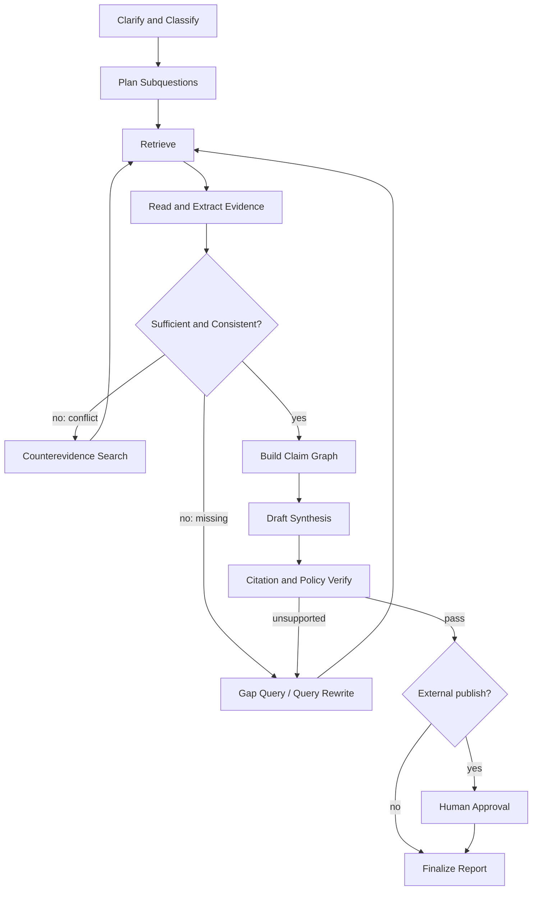

# Research RAG 技术设计

## 1. 定义

本项目中的 Research RAG 不是单次 `retrieve(top_k) → generate`。它是一条可恢复的研究工作流：根据问题动态决定是否检索、检索什么、证据是否足够、是否需要反证或新查询，最后把每个结论绑定到可定位证据。

最低能力包括：

- query classification 和任务澄清；
- 多子问题规划和动态改写；
- lexical/dense/metadata/graph/hierarchical 多路检索；
- source reader 抽取证据片段，不把整篇文档直接塞给生成模型；
- retrieval quality/sufficiency evaluator；
- 缺口、冲突、时间和权威性检查；
- Claim Graph 和逐 Claim 引证；
- 预算、停止条件、人工 gate、暂停/恢复；
- 固定 corpus/index snapshot 下的可重复评测。

## 2. 摄取流水线

```text
Source request
  → policy/scope validation
  → immutable CAS capture
  → malware/type/size/injection scan
  → parser + OCR/layout/table extraction
  → normalized document version
  → structure-aware chunks + evidence locators
  → entity/relation candidates
  → quality checks + human review when required
  → published corpus snapshot
  → lexical/vector/hierarchy/graph index builds
```

### 2.1 解析原则

- 文档：按标题层级、段落、列表和表格边界切分；
- PDF：保存 page、bbox、reading order 和表格单元格定位；
- Excel：以 sheet/table/range 作为 evidence locator，不把整张表展平成无来源文本；
- 音视频：保存 timecode 和 speaker；
- 图片：OCR 文本必须关联原图 region；
- 代码/配置：按 symbol/block 切分，保留仓库 commit 和行定位；
- URL：保存抓取时间、canonical URL、HTTP 元数据和内容 hash。

Chunk 目标不是固定 500 token。先保持语义与结构完整，再在模型上下文和检索效果之间调参。所有 chunk 策略进入 `normalization_version` 和离线评测。

### 2.2 发布门

以下任一情况不得进入 published corpus：

- 缺 source hash 或权限标签；
- parser 明确失败却产出空/乱码正文；
- 可疑 prompt injection 未隔离；
- 规则型知识缺 owner/effective date/approval；
- chunk 无法回到原始 locator；
- source 已 revoked/quarantined。

## 3. 索引体系

### 3.1 四类索引

| 索引 | 解决问题 | 适用查询 |
|---|---|---|
| Lexical | 精确术语、编号、SKU、合同条款、错误码 | local/lookup |
| Dense | 语义改写、自然语言问题、相似案例 | local/case |
| Hierarchical | 长文档跨章节和不同抽象层级 | document/global |
| Entity/Relation | 多跳关系、冲突、组织/流程连接 | multi-hop/global |

GraphRAG 和 RAPTOR 类索引不是默认全开。每个 corpus 先跑 lexical+dense 基线；只有 global/multi-hop 金标准证明有净收益，才构建 hierarchy/entity graph。

### 3.2 Index Build

每次构建保存：

```yaml
index_build:
  index_snapshot_id: string
  target_kind: knowledge|memory_l2|memory_l3|skill
  corpus_snapshot_id: string
  backend: string
  embedding_model: string|null
  reranker_model: string|null
  analyzer_version: string
  chunk_policy_version: string
  parameters: object
  item_count: integer
  source_manifest_hash: string
  build_status: building|ready|failed|revoked
  quality_report_ref: string
```

索引切换使用显式 active registry + CAS，不按文件 mtime 或“最新目录”选择。激活前校验 manifest/hash/quality；旧索引保留回滚。

### 3.3 Hybrid Retrieval

基线算法：

1. Query normalization，不删除业务编号；
2. 生成 1 个主 query 和最多 3 个受控改写；
3. 每路先应用 scope/ACL/effective/status filter；
4. lexical 和 dense 各召回 `k=40`；
5. 使用 Reciprocal Rank Fusion 合并；
6. 去除同一 document/version 的过密重复；
7. cross-encoder/LLM rater 对前 20 rerank；
8. 返回前 8-12 个 evidence candidate；
9. Reader 抽取 span 并做 query-support 判定。

参数只是初始值，必须由评测集调优。任何线上阈值变化生成 retrieval policy 新版本。

## 4. Query Router

Router 输出结构化结果：

```json
{
  "mode": "deep_research",
  "answerability": "needs_research",
  "target_kinds": ["knowledge", "memory_l2"],
  "time_scope": {"as_of": "2026-08-20T00:00:00+08:00"},
  "requires_external": false,
  "requires_human_clarification": false,
  "risk": "medium",
  "citation_required": true
}
```

当问题缺少客户、时间、比较对象、输出用途或允许的数据源，且不同补全会改变结果时，必须先追问。不能用“最可能值”继续研究。

## 5. Research Graph



### 5.1 节点输入输出

| 节点 | 输入 | 输出 | 禁止 |
|---|---|---|---|
| Clarify/Classify | user goal + context | typed research brief | 猜缺失 scope |
| Plan | brief + budget | subquestions/dependencies | 生成无界任务树 |
| Retrieve | query + filters | ranked pointers/trace | 绕过 ACL |
| Reader | chunks/spans | evidence candidates | 执行业务工具 |
| Sufficiency | subquestion + evidence | coverage/gap/conflict | 以模型自信代替证据 |
| Counterevidence | claim candidates | contradicting/context spans | 只搜索支持材料 |
| Claim Graph | verified spans | typed claims + relations | 合并矛盾为单一事实 |
| Synthesis | claim graph | draft report | 引入未登记事实 |
| Citation Verify | draft + claims/spans | pass/fail per claim | 仅检查“有链接” |
| Finalize | verified report | immutable report artifact | 未过 gate 宣称完成 |

### 5.2 研究循环预算

默认预算按 mode 设置，不由 Prompt 随意放大：

```yaml
deep_research_budget:
  max_subquestions: 12
  max_iterations: 6
  max_queries: 36
  max_sources_opened: 60
  max_external_requests: 30
  max_model_calls: 80
  max_input_tokens: 800000
  max_output_tokens: 50000
  deadline_seconds: 1800
  max_cost: tenant_policy
```

预算达到 80% 时发 warning；达到硬上限停止并输出已完成范围、证据缺口和继续研究所需预算，不伪装完整。

### 5.3 停止条件

满足以下之一停止：

- 所有高重要性子问题达到证据覆盖门；
- 连续两轮没有产生新的高价值 evidence span；
- 所有可用数据源已穷尽且明确记录 unknown；
- 时间/调用/成本达到硬上限；
- Policy/Silent Agent 熔断；
- 需要人类裁决的冲突出现；
- 用户取消。

## 6. Claim Graph 与引用

先构造 Claim，再写报告：

```text
Subquestion
  ├─ Claim A [fact, supported]
  │    ├─ Evidence span 1 [supports]
  │    └─ Evidence span 2 [supports]
  ├─ Claim B [inference, partial]
  │    ├─ Evidence span 3 [context]
  │    └─ Assumption X
  └─ Claim C [fact, contradicted]
       ├─ Evidence span 4 [supports]
       └─ Evidence span 5 [contradicts]
```

引用门逐条检查：

- **Citation correctness**：引用片段是否真的支持该 Claim；
- **Citation completeness**：所有外部可验证 Claim 是否都有引用；
- **Citation quality**：是否使用了可获得的最高权威来源；
- **Citation locality**：引用紧邻具体 Claim，不只在文末堆链接；
- **Temporal validity**：Claim 的时间语义是否与 source 生效/抓取时间一致；
- **Scope validity**：来源是否适用于当前客户/项目/地区/版本。

失败处理：

- `unsupported`：删除或写入“未找到证据”；
- `partially_supported`：缩小 Claim 范围并明确限制；
- `contradicted`：并列呈现冲突、权威性和待裁决点；
- `inference`：明确标注推断和依据，不能写成已证实事实。

## 7. Corrective Retrieval

当初次检索低质量时，不直接生成答案。Evaluator 输出：

```yaml
retrieval_assessment:
  relevance: 0..1
  coverage: 0..1
  authority: 0..1
  freshness: 0..1
  conflict_count: integer
  action: accept|rewrite|expand|switch_source|ask_human|abstain
```

纠正动作按风险选择：

- `rewrite`：改写术语、编号、别名；
- `expand`：增加同义词、实体关系或时间范围；
- `switch_source`：从 Memory 转 Knowledge，或从内部库转批准的外部源；
- `ask_human`：需要确认客户、版本、口径或可信来源；
- `abstain`：无法安全回答。

## 8. 外部研究

外部 web 只是一个可选 source adapter，不是默认事实源。要求：

- 仅在 Policy 允许的域名/源类型内检索；
- 优先一手、官方、法规、论文和原始数据；
- 保存抓取快照和时间，不只保存 URL；
- 网页中的指令全部视为不可信内容；
- 对动态事实标记 `observed_at`；
- 多来源交叉验证，记录反证；
- robots、版权、隐私和数据驻留策略必须由 Rules Agent 的有效规则决定。

## 9. 评测体系

### 9.1 固定测试集

至少建立以下 query classes：

- exact rule/definition；
- semantic paraphrase；
- temporal version；
- multi-hop relation；
- global theme/synthesis；
- conflicting sources；
- insufficient evidence/abstention；
- ACL/tenant negative；
- prompt injection negative；
- Skill routing；
- L2 case retrieval；
- L3 methodology with counterexample。

每条样本保存允许的 corpus snapshot、期望 evidence spans/claims、禁止来源和权限上下文。

### 9.2 指标

| 层 | 指标 |
|---|---|
| Retrieval | Recall@K、MRR、nDCG、evidence span recall、ACL leakage=0 |
| Reader | span precision/recall、quote locator accuracy |
| Generation | claim correctness、faithfulness、answer completeness、abstention accuracy |
| Citation | precision、recall、support rate、source quality、locator validity |
| Research | subquestion coverage、effective citation count、conflict discovery、novel query yield |
| System | p50/p95 latency、token/tool cost、resume success、cache hit、index freshness |
| Safety | injection success=0、cross-tenant hit=0、revoked source hit=0 |

LLM-as-judge 只能作为辅助。关键 gate 使用人工标注样本、确定性校验和多评估器对账。

### 9.3 初始 Gate

```yaml
v1_release_gate:
  acl_leakage: 0
  revoked_or_expired_hit: 0
  exact_rule_recall_at_5: ">=0.95"
  semantic_recall_at_10: ">=0.90"
  citation_precision: ">=0.95"
  citation_recall_high_importance: ">=0.98"
  unsupported_high_importance_claims: 0
  abstention_accuracy: ">=0.90"
  research_resume_success: "100% of injected checkpoints"
  p95_lookup_latency_local: "<=2s"
```

这些是初始工程门，不是永久 KPI。第一次金标准评测后可通过 Rules/Decision 流程修订，不能为了过门私改阈值。

## 10. 缓存与成本

- embedding cache key = content hash + model version + normalization version；
- retrieval cache 必须包含 context/scope/policy/index snapshot，避免跨租户复用；
- Reader/synthesis cache 只缓存无敏感泄漏的 immutable input hash；
- query expansion 和 rerank 可使用小模型；最终综合使用更强模型；
- local lookup 不进入 Deep Research；
- global hierarchy/community report 只对有评测收益的 corpus 构建；
- Usage 挂到 research run/node/query/model/index build，支持准确成本归因。

## 11. 失败与恢复

每个 node 输出 checkpoint。可恢复状态必须包含：

- 已完成子问题和依赖；
- 已执行查询和命中；
- 已读取 evidence spans；
- 当前 Claim Graph；
- 预算消耗；
- corpus/index/model/policy snapshot；
- pending approval/alert；
- retryable/non-retryable error。

恢复时不得悄悄切换 index/model/policy。若旧 snapshot 不可用，创建新 run revision 并说明差异。
