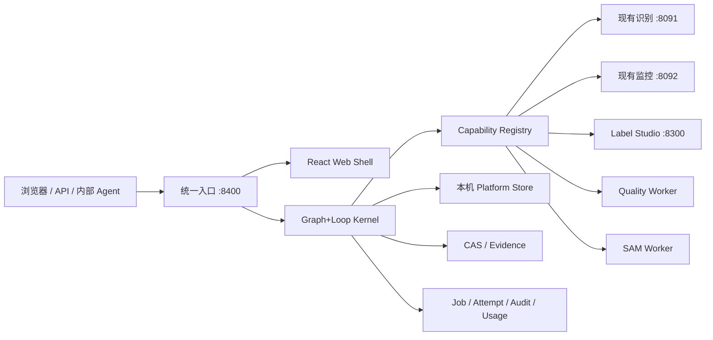

# LLM-Image 统一框架持续可用执行手册 V2

> 文档日期：2026-08-04  
> 当前代码基线：`feat/sam-reannotation@c9998af`  
> 文档性质：当前唯一实施编排入口，替代旧“全部 Foundation 门禁完成后再接业务”的执行顺序  
> 不替代：`2026-08-04-fmcg-vision-saas-platform-design.md` 的 L0 总体架构和业务边界  
> 本次审查权限：只读检查和文档更新；未修改业务代码、未启动训练、未切换模型、未删除文件

## 0. 执行方向

本项目从现在开始采用“持续可用的纵向建设”方式：

1. 保留已经可用的识别服务和训练监控，不等待新底座全部完成。
2. 先建立统一 Web 入口和兼容适配层，让用户第一阶段就能看到并使用现有能力。
3. Graph+Loop、任务、证据、数据、权限和计量围绕一条真实 FMCG 流程逐步落地，不空造大平台。
4. 每完成一个里程碑，系统都必须能启动、能通过浏览器验证、能执行一条真实流程、能显示失败原因。
5. Label Studio、SAM、训练或 PostgreSQL 暂时不可用时，只影响对应模块，统一工作台必须继续运行并明确显示 `degraded`。
6. 识别只是首个能力包；Graph+Loop 仍是系统核心。当前从识别切入，是为了用真实业务验证内核，不是把平台重新变成识别中心。

旧总纲仍保留完整 Stage 0–9 业务覆盖和验收要求，但不再要求 26 个 Foundation Task 全部完成后才出现第一个可用页面。本手册把它重排成可连续交付的纵向里程碑。

## 1. 权威文件与冲突规则

按以下顺序阅读：

| 等级 | 文件 | 当前作用 |
|---|---|---|
| L0 | `docs/superpowers/specs/2026-08-04-fmcg-vision-saas-platform-design.md` | 唯一总体架构、业务边界和长期技术方向 |
| L1 | 本手册 | 当前实际开工顺序、可用性标准、Agent 任务和停止线 |
| L1-历史 | `docs/superpowers/plans/2026-08-04-full-project-execution-program.md` | 保留 Stage 0–9 完整范围，旧串行门禁被本手册取代 |
| L1-参考 | `docs/superpowers/plans/2026-08-04-stage0-1-graph-loop-kernel.md` | Graph、Capability、IAM、CAS、Job、Billing 等详细设计素材，不再机械按 Task 1–26 大批量实施 |
| L1-训练 | `docs/superpowers/plans/2026-08-04-sam-assisted-reannotation-quality-filter-retraining.md` | SAM、质量、真框和训练专项约束 |
| L2 | `docs/CODEX-PROJECT-HANDBOOK.md` | 历史进展和接续事实索引 |
| L3 | `docs/implementation/**`、`docs/experiments/**` | 当前实现日志、问题和实验事实 |

冲突时：

- 产品和安全边界以 L0 为准。
- 实施顺序和“何时算可用”以本手册为准。
- 当前运行事实以实时命令、代码、制品和健康检查为准。
- 历史文档中的“已完成”不能覆盖实时服务不可达或缺少端到端证据的事实。

## 2. 2026-08-04 项目真实状态

### 2.1 Git 与测试

| 项目 | 实时结果 | 判断 |
|---|---|---|
| 当前分支 | `feat/sam-reannotation` | SAM/质量/真框相关代码尚未进入 `main` |
| HEAD | `c9998af` | 本手册以此为实施基线 |
| 本地 main | `3f55991`，比 `origin/main` 超前 11 个提交 | 远端不是当前完整事实源 |
| 工作树 | 仅 `.quality/`、`.sam_checkpoints/`、`.sam_runs/`、`.superpowers/` 未跟踪 | 不得清理或误提交这些制品 |
| 主机测试 | `170 passed in 1.98s` | 当前 Python 代码基线通过 |
| 沙箱测试 | `169 passed, 1 failed` | 唯一失败为沙箱看不到 MPS，不是 Mac 主机回归 |

### 2.2 当前真正可用的服务

| 能力 | 端口/证据 | 当前状态 |
|---|---|---|
| 生产识别 | `127.0.0.1:8091/v2/health` 返回 200；加载 `prod_20260804_v4_r2` | **可用** |
| 训练监控 | `127.0.0.1:8092/api/live` 和 `/api/overview` 返回数据 | **可用，但数据呈现存在历史口径混杂** |
| omlx | `127.0.0.1:8455` 正在监听，接口要求 API key | **进程可达，模型清单本轮未用密钥复核** |
| Label Studio | 8300 未监听 | **不可用** |
| ML Backend | 8301 未监听 | **不可用** |
| Orchestrator | 8304 未监听 | **不可用** |
| Legacy review | 8090 未监听 | **不可用/仅历史兼容** |
| PostgreSQL/Redis/MinIO | 5432/6379/9000/9001 未监听 | **未搭建运行** |

生产模型包 `prod_20260804_v4_r2` 已重新校验：`ok=true`，16 个文件通过，当前指针未改变。

### 2.3 当前数据和制品

| 资产 | 事实 |
|---|---|
| SQLite warehouse | 11 张表；28 SKU、9 asset、170 annotation、5 review event、3 model version、22 recognition run |
| 生产 bundle | 1 个，状态 production |
| E2 数据集 | train 2,000 / 50,018 框；val 300 / 7,975 框 |
| E2 pilot | P0/P1 已完成 3 epoch；均未达到晋级门槛 |
| SAM | Small/Base+ checkpoint 已有；Small 在 MPS 上通过速度门 |
| SAM 实际 LS payload | 只有 9 张、11 个 prediction、159 个 manual_required |
| 质量过滤 | 120 张演示；qa_v3 为 accept 92 / manual_review 28 / reject 0，尚无人工金标准混淆矩阵 |
| 审核队列 | 250 个任务，226 张唯一照片，全部 pending |
| 存储占用 | `.models` 2.9G、`.training_data` 3.0G、`.eval` 356M、SAM 约 901M |

### 2.4 模块成熟度

| 模块 | 代码 | 实际可用 | 主要缺口 |
|---|---:|---:|---|
| 级联识别 | 有 | 是 | 尚未接统一 Web、租户、Graph 和统一计量 |
| 训练监控 | 有 | 是 | 历史模型指标混杂；不是统一工作台 |
| Label Studio 适配 | 有 | 否 | 服务未启动；真实 diagnostic 导入和审核导出未闭环 |
| SAM 辅助标注 | 有试验实现 | 否 | 自动可用率低；只有 9 张演示；人工复核链未持久化 |
| 照片质量 | 有试验实现 | 部分 | 无人工金标准；不能自动删除或作为最终拒绝依据 |
| 真框评估 | 有 | 否 | `recall@FP` 实际实现为 `recall@TopK`，指标名与算法不一致 |
| E3 builder | 有 | 否 | 缺少 2,300 张完整人工审核 manifest 和正式 CLI 闭环 |
| 后台任务 | JSON + daemon thread | 部分 | 重启恢复、跨进程 worker、取消、租户隔离不足 |
| 数据底座 | SQLite 旧 warehouse | 部分 | 不是统一平台 schema；没有 IAM、Graph、Usage、Module 边界 |
| 统一 Web | 无 | 否 | 目前是多个独立 HTML 页面和端口 |
| Graph+Loop | 只有设计文档 | 否 | 没有可持久恢复的 Graph Runtime |
| Geo/问卷/BI | 只有规格 | 否 | 尚未实现 Domain Pack |

### 2.5 必须承认的当前问题

1. 根目录 `README.md` 只有标题，文档和真实入口难以发现。
2. `docs/README.md`、`runbook.md`、SAM `STATUS/RESULTS/PLAN` 之间存在状态冲突。
3. `scripts/start_label_studio.sh` 从 `scripts/` 上跳两级，可能把数据目录落到项目父目录；原生 LS 不能直接按现有脚本视为可靠可用。
4. `truebox_eval.py` 的 `recall@FP1/3/5` 实现是每图只取 top 1/3/5 proposal，不是真实 FP/photo 预算扫描。
5. 审核队列只有任务壳，没有 Label Studio task ID、图片入口、多框最终结果和持久化审核导出器。
6. `retrain` 旧入口默认 `auto_switch=true`，不符合“训练与发布分离”的现行边界；新统一入口不得暴露这条自动切换路径。
7. `jobs.py` 使用进程内 daemon thread；服务重启后运行中任务不能可靠恢复。
8. 当前仓库没有 `src/platform`、`src/modules`、`web/`、Graph Runtime、Capability Registry 或统一 IAM 实现。
9. 当前 170 项测试主要是 unit/contract；缺少完整服务联调、浏览器 E2E、恢复和容量测试。
10. 识别健康不等于业务准确率达标。生产 bundle 只能作为当前兼容基线，不能作为新平台质量承诺。

## 3. 新执行原则

### 3.1 每个里程碑都必须能使用

每个里程碑必须同时具备：

- 一个用户可打开的 URL；
- 一个可复制执行的 API/CLI；
- 一条真实数据流程；
- 明确的成功、失败和降级状态；
- 自动化测试；
- 实际运行证据；
- 回滚方式；
- 不影响当前 8091/8092 的证明。

只有代码、表、接口或测试，没有真实启动和用户入口，不算完成。

### 3.2 不再让局部模块阻塞全系统

- Label Studio 不可用：标注模块显示 degraded，任务保留，识别和 Graph 工作台继续运行。
- SAM 不可用：自动细化降级为 detector 框或人工画框，不伪造结果。
- 训练未获授权：训练页面可查看数据和计划，但启动按钮保持禁用并显示原因。
- PostgreSQL 未就绪：本机开发使用单一嵌入式适配器，不建立双写；在指定里程碑迁移到 PostgreSQL。
- 模型不可用：对应能力失败关闭，Graph 进入 `failed` 或 `waiting_human`，不返回假成功。

### 3.3 Adapter-first，不大爆炸重写

当前可用功能先作为 Legacy Capability 接入：

- `legacy.recognition.v2` → 8091；
- `legacy.training.monitor` → 8092；
- `legacy.label_studio` → 8300；
- `legacy.sam_assist` → 隔离 worker；
- `legacy.quality` → 当前 data_quality runner。

新平台不能直接 import 旧模块内部数据库实现作为长期事实源。第一步通过受控 adapter 调用，后续逐模块迁移。适配器必须报告版本、健康、超时、成本、失败类型和证据引用。

## 4. 第一阶段运行拓扑



第一阶段只新增一个对用户暴露的统一入口 `127.0.0.1:8400`。8091、8092、8300 等端口仍作为本机内部能力存在，Web 不要求用户逐个记端口。

## 5. 技术落地基线

### 5.1 后端

- Python 沿用当前可运行的 3.13 环境，不为了架构文档强制降级。
- 新控制面使用 FastAPI + Pydantic。
- API 统一前缀 `/api/v1`；健康检查区分 `healthy/degraded/unavailable`。
- 当前 `BaseHTTPRequestHandler` 服务先通过 HTTP adapter 接入，不立即重写。
- 所有长任务通过 Job/Attempt 接口执行；禁止新代码继续使用匿名 daemon thread 作为可靠任务系统。

### 5.2 前端

- 新建 `web/`，TypeScript + React + Vite，保持响应式并为 PWA 预留。
- 第一版就使用统一 Web Shell，不先造第二套临时 HTML。
- 页面至少包含：总览、Graph Runs、识别、标注审核、数据资产、训练模型、系统状态。
- 未完成页面显示真实状态和阻断原因，不显示假数据或“建设中但已完成”。

### 5.3 本机数据策略

- 长期事实库仍以 PostgreSQL 为目标。
- 为保证现在即可运行，M1–M3 允许使用单一 `PlatformStore` SQLite 开发适配器。
- SQLite 只用于本机单用户 bootstrap；表和 repository 不得使用 SQLite 专属业务语义。
- 不允许 SQLite 和 PostgreSQL 双写；M6 使用一次性、可核对的迁移切换。
- 旧 `.warehouse/db.sqlite` 默认只读接入；新平台事实写入独立 platform store，避免继续扩大旧 schema。
- 原图进入本机内容寻址存储，数据库只保存 ResourceRef、哈希、大小、类型和 lineage。

### 5.4 端口

| 端口 | 服务 | 对用户 |
|---:|---|---|
| 8400 | Unified API + Web Shell | 唯一主入口 |
| 8091 | Legacy recognition adapter | 内部 |
| 8092 | Legacy monitor adapter | 内部 |
| 8300 | Label Studio | 通过统一工作台跳转/代理 |
| 8301 | ML backend | 内部 |
| 8304 | 旧 orchestrator | 默认不启动，功能逐步迁入新入口 |
| 8455 | omlx | 内部模型能力 |

## 6. 持续可用里程碑

### M0：基线与保护

目标：开始开发但不破坏现有系统。

交付：

1. 从 `c9998af` 创建 `feat/usable-platform-foundation`。
2. 建立 `docs/implementation/platform-v2/{STATUS,PLAN,EXECUTION-LOG,ISSUES,DECISIONS,ACCEPTANCE}.md`。
3. 记录 8091/8092/8455、bundle、测试、数据和磁盘基线。
4. 记录未跟踪制品清单，不清理、不移动、不提交大文件。
5. 冻结 production switch 和 training start 为 false。

验收：主机测试仍为 170 passed；8091/8092 健康；bundle 16 文件通过。

### M1：统一 Web Shell 立即可用

目标：用户只打开一个页面就能看到当前系统。

交付：

1. `src/platform/api` FastAPI 控制面和 `web/` React 壳。
2. `/api/v1/health` 汇总自身与 8091/8092/8300/8301/8455 健康。
3. 首页显示系统、模型、训练状态、模块状态和真实阻断项。
4. 识别页支持上传图片并调用 8091，显示框、SKU、置信度、review 状态和耗时。
5. 训练页读取 8092，只读展示历史运行和当前是否在训练。
6. 标注页显示 Label Studio 状态；不可用时给出恢复入口，不阻塞其他页面。
7. 全部前端调用经 8400，不直接把内部端口散落到浏览器代码。

用户可见结果：打开 `http://127.0.0.1:8400`，可以查看状态并完成一次现有模型识别。

验收：

- 浏览器刷新、直达子路由和错误提示正常；
- 8091/8092 停掉任一服务，统一工作台仍可打开并显示 degraded；
- 上传超限、错误文件、模型过载和模型不可用有明确提示；
- 不启动训练、不切模型、不写入旧业务表以外的隐藏路径。

### M2：最小可信 Foundation

目标：统一入口不只是页面聚合，而具备可持续扩展的内核。

交付：

1. local admin、tenant、customer、project、service identity 最小模型。
2. Module Manifest、Capability Contract、Capability Registry。
3. Asset/ResourceRef、EvidenceBundle、AuditEvent、UsageEvent 基础契约。
4. Job/Attempt 状态机，支持重启后识别 orphaned/running 状态，不假装成功。
5. 统一 request_id、run_id、idempotency_key 和 UTC 时间。
6. Legacy adapters 注册为 Capability，不在 Kernel 写 FMCG 特例。
7. 本机 platform store migration 和备份校验。

用户可见结果：系统状态页可查看模块、能力、版本、健康、最近 Job 和审计事件。

验收：重启 8400 后历史 Job/Audit 仍可读；重复幂等请求不重复创建事实或计量。

### M3：第一条真实 Graph+Loop 纵向流程

目标：用一张真实照片证明 Graph+Loop 是运行内核，而不是文档。

Graph `fmcg_photo_inspection_v1`：

```text
上传/引用照片
  → 内容哈希入 CAS
  → 质量评估
  → 质量人工门或继续
  → 调用 legacy.recognition.v2
  → 按置信/冲突决定完成或 waiting_human
  → 保存 EvidenceBundle
  → 写 UsageEvent 和 AuditEvent
  → 输出 RecognitionResult DataProduct
```

必须实现：

- GraphDefinition 和 GraphVersion 不可原地修改；
- Run、NodeExecution、Checkpoint 持久化；
- 最大节点数、最大循环数、超时和预算；
- `waiting_human`、`failed`、`completed` 是正式状态；
- 节点重试不重复调用有副作用的能力；
- 页面显示节点时间线、输入输出摘要、证据、费用和失败原因；
- 一个最小非识别 `system_health_v1` Graph 同时验证 Kernel 无 FMCG 硬编码。

用户可见结果：上传一张照片后，可以看到完整 Graph 时间线和识别结果；若质量或模型失败，能看到停在哪个节点以及如何继续。

### M4：Label Studio 与人工审核闭环

目标：标注系统真正可用，而不是只有 payload。

交付：

1. 修正本机原生 Label Studio 启动路径，固定项目内数据目录和端口 8300。
2. 平台创建/导入/同步项目、任务、prediction、annotation、review、arbitration。
3. Assisted 和 blind 项目分离；盲标者不可见 SAM prediction。
4. Webhook Inbox 去重 + API 对账，不依赖 webhook 单点成功。
5. 自动框、人工初稿、第二审核、仲裁和最终框全部保留。
6. 错标、漏标、框错误、SKU 错误、质量错误、不可判定可统计。
7. 分享链接带 scope、有效期、领取和撤销。
8. 导出不可变 truebox manifest，支持一图多框和完整审核来源。

用户可见结果：在统一工作台创建一个 10 张试验项目，进入 Label Studio 完成标注、复核，再回到平台看到状态和导出结果。

验收：先跑 10 张 E2E，再扩 50 张效率对照；不直接生成 2,300 张任务。

### M5：数据集、训练和模型治理可用

目标：训练模块能管理全过程，但没有授权时不会消耗算力。

交付：

1. DatasetSnapshot、split guard、manifest hash、人工审核来源和质量结论。
2. 修复 truebox 的真实 FP/photo 扫描和互斥错误账本。
3. E0/P0/P1 统一推理导出与统一评估。
4. TrainingRun dry-run、MPS G0、算力预算、停止线、日志和 checkpoint 注册。
5. 训练启动需要显式用户授权；训练完成只产生 candidate，不自动发布。
6. 禁用旧 `/retrain auto_switch=true` 语义；发布必须是独立审批命令。
7. 训练页面显示 dataset、门禁、运行、指标、资源、模型和发布状态。

用户可见结果：即使训练尚未获批，用户也能在页面看到“为什么不能训练、还差什么、批准后将运行什么命令”。

### M6：PostgreSQL、可靠 Worker 与本机硬化

目标：从开发可用进入可长期运行。

交付：

1. PostgreSQL 原生或容器运行路径至少一种真实通过。
2. PlatformStore 从 SQLite 单次迁移到 PostgreSQL，逐表计数/哈希核对，不双写。
3. Job/Attempt 使用可恢复 worker；支持取消、超时、重试、dead-letter 和背压。
4. 本机 CAS 校验、备份、恢复和磁盘水位预警。
5. 统一身份、权限、CORS、CSRF、分享链接、secret 和审计加固。
6. 性能测试覆盖 API、Graph、识别并发、训练干扰、重启恢复和 8TB 增长模型。

验收：迁移前后事实计数和哈希一致；任一 worker 崩溃不会产生重复完成或重复计量。

### M7：后续 Domain Pack 插入

在 M0–M6 的统一底座上继续：

1. Geo & Field Operations；
2. Questionnaire；
3. BI & Analytics；
4. 包装版本、新包装发现、VLM challenger 和四档识别；
5. Graph Studio、RateCard 和 platform token 商品化。

每个 Domain Pack 都必须先交付一个可用纵向 Graph，再扩全功能，不允许复制 IAM、Job、Asset、Evidence、Billing、Audit 或 Agent Runtime。

## 7. 目标目录边界

```text
src/
  platform/
    api/              FastAPI composition root、health、错误契约
    kernel/           Graph/Loop 状态机、检查点、预算
    modules/          Manifest、Capability Registry、生命周期
    iam/              身份、租户、客户、项目、授权上下文
    data/             PlatformStore repository 和 migrations
    assets/           CAS、ResourceRef、EvidenceBundle
    jobs/             Job/Attempt、worker、重试和恢复
    usage/            UsageEvent、成本和计量
    audit/            AuditEvent、outbox/inbox
    adapters/legacy/  8091/8092/8300/quality/SAM 适配器
  modules/
    reference_echo/   非识别验证模块
    fmcg_vision/      FMCG 业务事实和 Graph
    annotation_review/
    training_model/
web/
  src/platform/       Web Shell、导航、系统状态、Graph Runs
  src/modules/        各模块页面和 UI 注册
contracts/            JSON Schema/OpenAPI/事件/命令
docs/implementation/platform-v2/
```

强制依赖方向：

- `src/platform` 不 import `src/modules`。
- 模块通过 Manifest 和注册函数接入 composition root。
- 模块之间不直接 import 或写表。
- 旧 `src/recognize`、`src/training`、`src/ls_platform` 先经 adapter 接入。
- 前端模块只能通过公开 API/SDK，不读取本机绝对路径。

## 8. 最小统一契约

第一批必须冻结：

- `RequestContext`：request_id、actor、tenant、customer、project、scopes；
- `ModuleManifest`：module_id、version、capabilities、routes、ui_slots、health；
- `CapabilityDefinition`：input/output schema、side_effect、timeout、cost_meter、permission；
- `GraphDefinition/GraphVersion`；
- `GraphRun/NodeExecution/Checkpoint`；
- `Job/Attempt`；
- `Asset/ResourceRef/AssetRelation`；
- `EvidenceBundle/EvidenceItem`；
- `AuditEvent`；
- `UsageEvent`；
- `HumanTask/PendingCommand`；
- `RecognitionCommand/RecognitionResult`；
- `DatasetSnapshot/TrainingRun/ModelVersion`。

契约必须有 JSON Schema/Pydantic 类型、示例 fixture、版本和破坏性变更测试。

## 9. 可用性验收矩阵

| 维度 | 每个里程碑最低证据 |
|---|---|
| 正确性 | unit + contract + integration；关键流程 E2E |
| Web | 浏览器打开、刷新、错误态、无服务降级、控制台无阻断错误 |
| API | OpenAPI、类型、错误码、请求大小、超时和幂等 |
| 数据 | 原件不覆盖、写入可追溯、迁移可核对、历史可读 |
| 恢复 | API/worker 重启、running job 恢复或明确 orphaned |
| 性能 | p50/p95、吞吐、内存；重模型需 MPS/CPU 后端证据 |
| 安全 | 本机默认最小暴露；写接口授权；路径/URL/上传防护 |
| 计量 | 每个外部模型/重任务至少产生一次可对账 UsageEvent |
| 回归 | 当前主机 170 项测试持续通过；8091/8092 不退化 |
| 证据 | commit、命令、输出、版本、失败和剩余风险进入执行日志 |

## 10. 训练和模型边界

框架建设不等于授权训练。

在 M5 之前：

- 不启动新的 3ep/10ep 训练；
- 不启动 classifier；
- 不发布 bundle；
- 不修改 `prod_20260804_v4_r2`；
- 不恢复 v6；
- 不把当前错误的 truebox 指标用于晋级。

M5 通过后仍需用户单独确认训练命令。训练 Agent 只能生成 candidate，模型发布是另一个审批动作。

## 11. Git 和文件安全

1. 新实施分支基于 `c9998af`，保证 SAM/质量资产不会丢失。
2. 不自动 merge、push、deploy 或切 production。
3. 不运行 `git add .`、`git add -A`、`git clean`、`git reset --hard`。
4. 不删除、移动或覆盖原图、SQLite、模型、数据集、review、SAM、quality、eval、日志、备份和失败制品。
5. 每个里程碑至少一个小提交；提交前列出暂存文件。
6. 新依赖必须锁版本并记录许可证；不升级主 torch/ultralytics 破坏 MPS 基线。
7. 若实施在新 worktree，旧数据只通过明确只读配置接入；不得复制 8TB 资产，也不得用隐式符号链接改变事实位置。

## 12. 执行记录

Agent 开工后立即建立：

```text
docs/implementation/platform-v2/
  STATUS.md          当前里程碑、服务和阻断项
  PLAN.md            可勾选工作包和 owner
  EXECUTION-LOG.md   时间、命令、退出码、耗时、结果、制品
  ISSUES.md          问题、严重性、证据、状态、修复 commit
  DECISIONS.md       新决策及其取舍
  ACCEPTANCE.md      M0–M7 的实际验收结果
```

任何“完成”必须同步更新 STATUS 和 ACCEPTANCE。失败不得写成“基本可用”。

## 13. 第一启动批次的工作包

第一位 Agent 不再一次吞下旧计划的 26 个大任务。先连续完成以下工作包：

1. **W0 Baseline**：分支、制品保护、170 tests、8091/8092/bundle 证据。
2. **W1 Scaffold**：新增 platform/web 目录、依赖、启动命令和最小测试。
3. **W2 Health adapters**：8091/8092/8300/8301/8455 状态聚合，错误分类和超时。
4. **W3 Web Shell**：总览、模块导航、系统状态和 degraded UI。
5. **W4 Recognition bridge**：图片上传、限制、调用 8091、结果可视化和错误态。
6. **W5 PlatformStore**：最小 migration、request/audit/usage/job/asset 契约。
7. **W6 Capability Registry**：注册 legacy recognition、monitor 和 reference echo。
8. **W7 Graph Kernel**：持久状态机、检查点、预算、人工等待和恢复。
9. **W8 Asset/CAS**：上传、SHA、去重、lineage、缩略图和证据引用。
10. **W9 FMCG Graph**：质量 → 识别 → 人工门 → DataProduct。
11. **W10 Run UI**：节点时间线、证据、费用、继续/取消权限边界。
12. **W11 M3 Acceptance**：浏览器 E2E、API、重启、降级、性能、旧服务回归。

W11 通过后，Agent继续执行 M4–M6；遇到需要真实人工标注、训练授权、生产切换、删除或外部账号时，停止对应动作，但继续推进不依赖该输入的工作。

## 14. Agent 完成报告格式

```text
STATUS: M<N> ACCEPTED / NOT_ACCEPTED
BASE_COMMIT:
FINAL_COMMIT:
VISIBLE_URL:
WORKING_USER_FLOW:
SERVICES:
TESTS:
BROWSER_E2E:
RECOVERY:
PERFORMANCE:
SECURITY:
DATA_AND_EVIDENCE:
OPEN_ISSUES:
NEXT_MILESTONE:
production_switch=false
training_started=false
deleted_files=false
```

## 15. 给实施 Agent 的完整启动提示词

将下面整段交给实施 Agent：

```text
你现在负责 LLM-Image 项目的统一框架持续可用建设。不要继续采用“先完成全部 Foundation 再给用户看”的大阶段方式；按照新手册做纵向交付，每个里程碑必须保持系统可启动、可浏览、可执行真实流程。

仓库：/Users/zhangweiqi/Documents/QY/项目/LLM-Image
当前审计基线：feat/sam-reannotation@c9998af

开工前必须完整阅读，不能只搜索关键词：
1. /Users/zhangweiqi/Documents/QY/项目/LLM-Image/docs/superpowers/specs/2026-08-04-fmcg-vision-saas-platform-design.md
2. /Users/zhangweiqi/Documents/QY/项目/LLM-Image/docs/superpowers/plans/2026-08-04-continuous-usable-framework-execution-manual.md
3. /Users/zhangweiqi/Documents/QY/项目/LLM-Image/docs/CODEX-PROJECT-HANDBOOK.md
4. /Users/zhangweiqi/Documents/QY/项目/LLM-Image/docs/implementation/sam-reannotation/STATUS.md
5. /Users/zhangweiqi/Documents/QY/项目/LLM-Image/docs/implementation/sam-reannotation/DECISIONS.md
6. /Users/zhangweiqi/Documents/QY/项目/LLM-Image/docs/training-history-and-decisions.md
7. /Users/zhangweiqi/Documents/QY/项目/LLM-Image/docs/superpowers/plans/2026-08-04-git-version-control.md
8. /Users/zhangweiqi/Documents/QY/项目/LLM-Image/docs/services.json

阅读后先执行只读盘点，再建立：
docs/implementation/platform-v2/STATUS.md
docs/implementation/platform-v2/PLAN.md
docs/implementation/platform-v2/EXECUTION-LOG.md
docs/implementation/platform-v2/ISSUES.md
docs/implementation/platform-v2/DECISIONS.md
docs/implementation/platform-v2/ACCEPTANCE.md

把本手册 M0–M7 和 W0–W11 转成可勾选 list。每个命令、退出码、耗时、关键结果和制品路径写入 EXECUTION-LOG；每个问题写 ISSUE；每个新判断写 DECISION。不得伪造人工结果或把代码存在写成服务可用。

Git 要求：
- 先确认当前 HEAD；若为 c9998af，从它创建 feat/usable-platform-foundation。
- 如果目标分支或工作目录已存在，不要删除，停止并检查或换明确新名称。
- 不 git add .，不 git add -A，不自动 merge/push/deploy/force-push。
- 不暂存 .env、原图、数据库、模型、数据集、SAM checkpoint、quality、eval、日志、备份或临时制品。
- 保留用户和其他 Agent 的所有已有改动。

实施方法：
- 使用 Superpowers 的 writing-plans / test-driven-development / verification-before-completion；浏览器验收先用 gstack qa-only 或等价只读 QA。
- 先写失败测试，再写最小实现，再运行局部和全量测试，再提交当前工作包。
- 不要机械执行旧 Stage0–1 的 26 个大任务；旧计划只作详细设计参考。
- 先连续完成 W0–W11，让 M0、M1、M2、M3 依次达到 ACCEPTED。
- W11 通过后继续 M4 Label Studio、M5 数据集训练治理、M6 PostgreSQL/Worker 硬化；不需要每个普通技术决定都停下来询问。

必须保留的现有能力：
- 8091 识别服务当前可用，bundle=prod_20260804_v4_r2。
- 8092 训练监控当前可用。
- 新统一入口使用 127.0.0.1:8400。
- 8091/8092 先通过 adapter 接入，禁止第一阶段重写或切换生产入口。
- 8300/8301/8455 不可用时，统一工作台显示 degraded，但自身必须继续工作。

目标技术边界：
- 后端 FastAPI/Pydantic；前端 TypeScript/React/Vite。
- 新代码位于 src/platform、src/modules、web、contracts。
- Platform 不 import 具体 Domain Pack；模块通过 Manifest/Capability 注册。
- M1–M3 可使用单一 SQLite PlatformStore 开发适配器，旧 warehouse 默认只读；不得双写 PostgreSQL。
- 原图进入内容寻址存储，数据库只保存哈希、ResourceRef 和 lineage。
- Graph Run、Node、Checkpoint、Job、Audit、Usage 必须持久化并支持重启后的明确恢复语义。
- 不允许任意 SQL、shell、文件系统或 Python import capability。

第一条可用流程：
浏览器上传照片 → CAS → 质量评估 → 识别 8091 → 置信/冲突人工门 → EvidenceBundle → Usage/Audit → RecognitionResult DataProduct。
同时实现 system_health_v1 非识别 Graph，证明 Kernel 没有 FMCG 硬编码。

M1 验收必须真实打开 http://127.0.0.1:8400，看到总览、识别、标注、数据、训练、Graph、系统状态；完成一次图片识别；停掉或模拟 8300 不可达时页面仍可用并显示 degraded。

M3 验收必须显示一条真实 Graph 时间线，包含节点状态、检查点、证据、用量、失败原因和人工等待状态；重启服务后 Run 仍能读取或按契约恢复。

Label Studio 到 M4 时必须使用本机原生 1.23.0 路线，修复现有 start_label_studio.sh 项目根路径；先完成 10 张真实 E2E，再做 50 张 assisted/blind 对照。不要直接生成 2,300 张任务。

训练边界：
- 本轮框架建设没有训练授权。
- 不启动 3ep/10ep/classifier，不恢复 v6，不修改 production bundle。
- 先修 truebox 的真实 FP/photo 评估语义和统一推理导出。
- 旧 /retrain 的 auto_switch=true 不得进入新平台；训练和发布必须分离。
- M5 只能完成 dry-run 和治理，真正训练必须再次获得用户明确授权。

安全红线：
- 不删除、移动、覆盖任何原图、SQLite、模型、数据集、审核、SAM、quality、eval、日志、备份或失败制品。
- 不自动切 production，不自动发布，不清理未跟踪目录。
- 不把秘密、客户数据、本机绝对文件路径暴露到前端或日志。

每个里程碑结束：
1. 更新 STATUS/PLAN/EXECUTION-LOG/ISSUES/DECISIONS/ACCEPTANCE；
2. 运行局部、全量、浏览器 E2E、恢复和旧服务回归；
3. 只提交本里程碑文件；
4. 保持已通过里程碑继续可用；
5. 失败就写 NOT_ACCEPTED 和真实原因，修复后重新验收。

只有遇到真实人工标注、外部账号/许可证、训练启动、生产切换、删除或不可逆迁移时才停止并向用户请求授权。普通实现问题自行调查、测试并继续。

最终报告严格使用本手册第14章格式，并明确：production_switch、training_started、deleted_files 均为 false。
```

## 16. 本轮审查结论

项目适合立即开始统一框架建设，但不能把现有多个页面直接拼在一起就称为 Graph+Loop 平台。正确入口是：保留 8091/8092 作为已验证能力，先交付 8400 统一工作台，再在一条真实照片流程中建立最小可信 Foundation 和 Graph Runtime。

当前结论：

```text
FRAMEWORK_BUILD: GO
CURRENT_RECOGNITION: AVAILABLE
CURRENT_MONITOR: AVAILABLE
UNIFIED_WEB: NOT_BUILT
GRAPH_LOOP_RUNTIME: NOT_BUILT
LABEL_STUDIO: DOWN
TRAINING: STOPPED_AND_NOT_AUTHORIZED
PRODUCTION_BUNDLE: VERIFIED_AND_UNCHANGED
```

