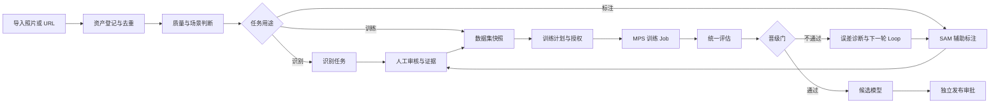

# LLM-Image 统一管理与全量照片训练执行手册

> 文档版本：V1.0
> 审查日期：2026-08-05（Asia/Shanghai）
> 当前代码基线：`feat/usable-platform-foundation@9db9946`
> 文档性质：从当前原型进入“统一、易用、可训练”的唯一实施入口
> 本轮边界：只做只读审查与文档更新；未修改业务代码、未启动训练、未切换模型、未删除或清理任何文件
> 训练结论：**当前 NO-GO；修复本手册 P0 门禁后，可自动进入 1 epoch smoke 和 3 epoch pilot，但不得自动进入 10 epoch、不得发布或切换生产模型**

## 0. 给项目负责人的直接结论

当前项目不是“什么都没有”：8400 已经能统一展示 8091、8092、Label Studio 和两条持久化流程，310 项主机测试通过，Apple MPS 路线也已验证。但它仍属于**可演示的平台原型**，还没有达到面向业务人员的统一管理系统，更不能按当前训练页直接启动训练。

最关键的四个问题是：

1. 训练页生成的命令带有真实训练脚本不支持的 `--dataset`、`--budget-minutes` 参数，复制执行必然失败。
2. 平台中唯一的 `e2_product_pilot@v1` 快照只是 2 张 train + 1 张 val 的演示记录，并不是真实 E2 数据集。
3. `recall@FP/photo` 实际仍是“每图取前 K 个框”，文档却宣称已经修复；它不能用于晋级。
4. 当前 Graph 只是按固定列表顺序执行节点，`max_loops` 只是同节点重试上限，不是条件边、反馈、收敛和动态决策组成的 Graph+Loop。

因此本轮的正确动作不是直接跑一个更大的训练，而是先用 1 个短阶段修复训练真实性，再把全部照片接入统一资产和标注流，随后在 MPS 上执行受控 smoke/pilot。这样不会继续消耗数小时训练出无法解释、无法比较的结果。

## 1. 权威顺序与工作原则

新 Agent 必须按以下顺序阅读：

1. `docs/superpowers/plans/2026-08-05-unified-management-all-photo-training-execution-manual.md`（本手册，当前执行入口）
2. `docs/superpowers/specs/2026-08-04-fmcg-vision-saas-platform-design.md`（长期 L0 架构与业务边界）
3. `docs/superpowers/plans/2026-08-04-continuous-usable-framework-execution-manual.md`（历史建设顺序）
4. `docs/implementation/platform-v2/{STATUS,PLAN,ISSUES,ACCEPTANCE,EXECUTION-LOG,DECISIONS}.md`
5. `docs/training-history-and-decisions.md`
6. `docs/superpowers/plans/2026-08-04-sam-assisted-reannotation-quality-filter-retraining.md`
7. `docs/superpowers/plans/2026-08-04-final-training-execution-gate.md`
8. `docs/CODEX-PROJECT-HANDBOOK.md`

冲突规则：

- 产品边界以 L0 为准；当前执行顺序和门禁以本手册为准。
- 实时代码、数据、服务和测试证据高于旧文档的勾选状态。
- 历史日志不得改写；发现历史结论错误时追加“审计纠偏”。
- 原始照片、SQLite 历史、模型、审核、SAM、quality、eval、日志、备份、失败制品一律保留，不覆盖、不清理。
- 不使用 `git add .` 或 `git add -A`；每个提交只暂存明确文件。
- 识别是第一个 Domain Pack，Graph+Loop 才是产品核心。

## 2. 2026-08-05 已核验状态

### 2.1 Git、测试与运行

| 项目 | 核验值 | 判断 |
|---|---|---|
| 分支 / HEAD | `feat/usable-platform-foundation@9db9946` | 当前代码未合入 main |
| 工作树 | `.quality/`、`.sam_checkpoints/`、`.sam_runs/`、`.superpowers/` 未跟踪 | 均为用户制品，不清理、不误提交 |
| 全量测试 | 主机 `310 passed, 1 skipped`；沙箱仅 MPS 不可见导致 1 项失败 | 代码回归基线可用，MPS 必须以主机证据为准 |
| 8400 | 进程监听；主机 `/api/v1/health` 返回 degraded | 统一入口可用，8301 不可用 |
| 8091 / 8092 | healthy | 生产识别与旧监控可用 |
| 8300 | healthy | Label Studio 可用 |
| 8301 | unavailable | ML backend 未运行 |
| 8455 | healthy | omlx 健康 |
| PostgreSQL | 16.14 演练迁移 16/16 表计数和哈希一致 | 仅演练；未授权生产切换 |
| 训练授权 | `training_authorized=false` | 未启动训练 |
| 生产模型 | `prod_20260804_v4_r2` | 保持不变 |

### 2.2 当前统一 Web 的真实成熟度

本轮已经通过真实浏览器逐页检查 `/#/`、`/#/runs`、`/#/recognition`、`/#/annotation`、`/#/assets`、`/#/training`、`/#/status`。页面能打开、无明显控制台错误，但整体仍以开发内部名词组织，用户必须理解 M4/M5、Graph Run、batch_id、assisted/blind、raw JSON 才知道下一步。

当前可用能力：

- 服务健康汇总和 3 个 legacy Capability。
- 单张照片上传识别。
- 两条历史 Graph Run 的列表、节点时间线和人工门。
- Label Studio 双项目试验批次、导入和机械对账。
- 训练治理只读列表和 dry-run 记录。

当前不可称为“统一管理”的原因：

- 没有“我的待办 / 下一步 / 阻断原因 / 负责人 / 截止时间”的统一任务中心。
- 数据资产页没有真实资产清单、质量、血缘和数据用途，且仍错误显示 CAS 未启用。
- 识别只支持单文件，没有批量照片、URL、API、Agent 三入口的统一任务与历史。
- 标注页没有任务派发链接、人员工作台、双审/仲裁进度、最终框和训练就绪状态。
- 训练页看似能操作，实际上只能造 dry-run 记录，不能生成合法命令、不能运行或停止 Job。
- 系统状态页暴露内部 flag 和 capability ID，缺少版本、数据新鲜度、当前活动任务和可执行动作。

## 3. 当前 Bug 与架构缺口清单

### 3.1 P0：训练前必须修复

| ID | 问题与证据 | 影响 | 修复要求 | 验收 |
|---|---|---|---|---|
| UMT-001 | `src/eval/truebox_eval.py:59-70` 将 FP 预算实现为逐图 `preds[:K]`；`tests/unit/test_truebox_eval.py:54-69` 又把该行为锁死 | 不是固定 FP/photo，晋级判断失真 | 使用全数据集统一置信度阈值扫描；逐阈值按置信度降序 one-to-one 匹配；FP 包含重复、背景、定位错误；明确是否插值；输出阈值和完整曲线 | 构造“2 TP 后才出现第 1 个 FP”的反例，FP1 应允许 2 TP，不得只取 1 个 proposal；与独立参考实现逐点一致 |
| UMT-002 | `src/modules/training_gov/service.py:222-227` 生成 `--dataset` 和 `--budget-minutes`；`src/training/train_v1.py:288-315` 没有这两个参数 | dry-run 命令不可执行 | 从不可变 Snapshot 解析真实 `data.yaml`，使用绝对 Miniconda Python、`--data-yaml`、`--run-name` 等真实参数；生成后必须做 CLI 解析预检 | 对生成命令执行 no-train/parse check 为 0；未知参数测试 fail-closed |
| UMT-003 | `.platform/platform.sqlite` 唯一 Snapshot 的 manifest 只有 `d1,d2,e1`，来源写“治理演示”，却命名为 `e2_product_pilot@v1` | 演示数据可能被误当真实数据授权训练 | 演示快照标记 `demo/invalid_for_training`；建立只由 builder 产生的真实 Snapshot，引用实际文件、数据集 audit、manifest hash、class/count、审核状态和协议排除报告 | UI 明示“演示，不可训练”；真实 Snapshot 逐文件存在/哈希/标签/数据 YAML 验证通过才 registered |
| UMT-004 | Snapshot API 接受任意 manifest 和自由文本“人工审核通过”；只检查 sha/store/session 交集 | 可以伪造来源结论，缺 photo_id、别名和冻结协议守卫 | Snapshot 只能由服务端 builder 从 Asset/Label/Evidence 事实表生成；五键为 photo_id、SHA、规范门店、模糊别名、session；验证 active protocol 0 泄漏 | 伪造 conclusion、缺文件、缺审核、协议命中、近重复跨 split 均拒绝 |
| UMT-005 | `mps_g0 = sys.platform == "darwin"`（`service.py:221`） | macOS 被误报为 MPS 可用 | 实测 arm64、torch MPS built/available、1024² 矩阵、模型一轮前向、无 fallback、AC 电源和磁盘/内存；证据写入 run | 任一检查失败，训练按钮保持禁用，输出具体失败项 |
| UMT-006 | 训练/Graph 写 API 信任客户端 `X-Role` / `X-Actor`；Run 上传、启动、人工批准没有真实身份校验 | 任意本机请求可伪装 admin；审计主体不可信 | 本机阶段建立真实登录 session/CSRF、服务端 role；API/Agent token 分 scope；禁止由客户端 header 自证身份 | 伪造 header 不能授权训练或批准门；真实 admin session 可用且留审计 |
| UMT-007 | `start_training()` 只把 kind/status 改为 authorized（`service.py:249-260`），不会提交可恢复 Job | “开始训练”与实际行为不一致 | 分成 `approve_plan` 与 `enqueue_training_job`；训练由 M6 Worker 执行、可取消/恢复/超时/留日志；两动作在 UI 中分开 | 点击批准不消耗算力；点击启动后才产生 job/attempt/PID/log，状态一致 |
| UMT-008 | M5 验收文档写“truebox 已修复”，ISSUES 与代码仍显示未修复 | 决策证据相互矛盾 | M5 状态改为 REOPENED；保留旧日志并追加本次纠偏 | STATUS/PLAN/ISSUES/ACCEPTANCE/EXECUTION-LOG 一致 |

### 3.2 P1：统一管理与模型质量关键问题

| ID | 问题 | 修复方向 |
|---|---|---|
| UMT-101 | GraphDefinition 只有节点元组，Engine 固定 `for` 循环；没有边、条件路由、反馈循环、收敛或每轮预算 | 新增 typed edge、condition/router、loop state、observation/decision/action、convergence、loop budget、human gate、resume；旧 Graph 作为 sequential adapter 保留 |
| UMT-102 | 资产页写“CAS 尚未启用”，但 CAS 已有 2 个 blob 且 W8/M6 已完成 | 接真实 Asset API：来源、SHA、pHash、质量、用途、血缘、审核、协议角色、存储位置；删除错误静态文案 |
| UMT-103 | 标注系统只完成 assisted/blind 机械对账，250 个 diagnostic 审核任务全部 pending、final_box 为 0 | 增加统一审核任务、链接派发、认领、初审、盲审、仲裁、错标/漏标、SLA、最终框、导出和训练就绪门 |
| UMT-104 | 所有照片没有一份统一 Asset ledger，目录、URL、symlink、派生图和重复图容易重复计数 | 建不可变 `source_asset_inventory_v1`；SHA 精确去重 + pHash/embedding 近重复组；只注册引用，不移动原图 |
| UMT-105 | 全量第三批旧过滤 22,664 张只判 5 张坏图，120 张 qa_v3 又没有人工金标准 | 建严重斜拍、反光、翻拍/屏摄、模糊、近景大头照、裁切、遮挡、场景不适用的分层金标准；所有判断保留证据图、指标、模型版本和人工结论 |
| UMT-106 | 训练页把 8092 的历史 ResNet18 `phase=train` 当当前活动训练，和 `training_started=false` 同屏 | 将“当前活动 Job”“历史实验”“当前生产模型”分成三块；没有活跃 job 时必须显示 idle |
| UMT-107 | 页面以 M4/M5、Graph Runs、batch_id 和 JSON 为主要语言 | 默认改用业务语言和明确下一步；内部字段放高级详情；建立统一工作台和角色首页 |
| UMT-108 | 识别入口不完整 | 同一 RecognitionTask 支持单图、批量文件、URL、API、Agent；统一输出、证据、价格档位、耗时、模型链、审核状态 |
| UMT-109 | 训练/标注 dry-run 可重复创建相同记录，没有幂等、分页、筛选和归档视图 | 写操作要求 idempotency_key；列表分页和按状态/时间/数据集筛选；重复请求返回同一任务 |
| UMT-110 | truebox 错误账本并非互斥：坏定位也可能同时作为背景；晋级只用 background FP，忽略 duplicate/localization | 定义互斥优先级和守恒式；在每个置信度阈值下 `FP_total = duplicate + localization + background + taxonomy...`；业务门使用 total FP/photo |
| UMT-111 | 100 job 的轻量测试不足以证明每日 10 万照片能力 | 建真实照片队列 benchmark：入队、下载、预处理、MPS 推理、写证据分段计时；测 sustained、burst、p50/p95/p99、失败重试、磁盘增速 |
| UMT-112 | 根 `README.md` 只有标题，文档入口难发现；STATUS HEAD 和部分服务状态已漂移 | 根 README 指向本手册与启动入口；自动生成状态快照但不改写历史日志 |

### 3.3 P2：后续完善

- 列表虚拟化、分页、搜索、批量操作、保存筛选器。
- URL 下载白名单、大小/类型/重定向限制、恶意文件与 SSRF 防护。
- 移动端/小程序适配、无障碍和浏览器矩阵。
- tenant/customer/project 先做字段与边界，不在本机阶段引入复杂计费结算。
- 识别档位低/中/高/极高由版本化策略配置，不在页面硬编码模型名称。
- 用户量暴增后再从本机 worker 水平扩展，当前先保证契约、幂等和分区键不推倒重来。

## 4. 统一管理目标

### 4.1 用户主路径



### 4.2 统一导航

| 一级入口 | 默认回答的问题 | 第一阶段必须具备 |
|---|---|---|
| 首页 | 我现在要做什么？系统是否正常？ | 我的待办、活动任务、阻断项、数据就绪度、服务异常、快捷入口 |
| 任务中心 | 哪些任务等人/等机器/失败？ | 识别、标注、审核、训练、Graph 统一状态与责任人；支持链接派发 |
| 数据中心 | 照片从哪来、质量如何、用到哪里？ | 文件/URL 导入、去重、证据、质量、场景、标签、血缘、用途、冻结角色 |
| 标注与审核 | 该画什么、谁复核、最终结论是什么？ | LS 完整能力入口 + 平台任务分配、SAM 自动框、双审/仲裁和 final box |
| 训练中心 | 数据是否可训、正在跑什么、为什么停？ | 真实 Snapshot、门禁、合法命令、MPS、预算、实时 job、实验对比、候选模型 |
| 识别中心 | 如何提交、多少钱、结果可靠吗？ | 文件/URL/API/Agent 四入口；批量；低/中/高/极高档位；证据与人工复核 |
| Graph+Loop | 系统如何决策和持续改进？ | Graph 版本、边/条件/循环、人门、预算、轨迹、证据、成本和回放 |
| 系统管理 | 版本、存储、服务、权限是否安全？ | 服务、worker、队列、模型、存储水位、备份、版本、审计、用户/角色 |

### 4.3 易用性规则

1. 每页首屏只显示“当前状态、下一步、为什么、谁负责”。
2. 内部 M 编号、hash、raw JSON 默认折叠到“技术详情”。
3. 所有状态使用一致词汇：待处理、处理中、等人工、已完成、失败、已取消、已阻断。
4. 所有按钮在不可用时说明缺哪个门禁，不能只置灰。
5. 所有写操作都有预览、幂等键、操作者、时间和审计事件。
6. Label Studio 保留完整原生界面，但平台负责批次、分配、证据、状态和最终输出。
7. 任何识别、标注或训练结果都能回到原始 Asset 和证据链。

## 5. 全部照片的统一使用方案

“使用全部照片”定义为：**每个源照片都进入资产台账、完成去重和用途裁决，并至少归入训练、评估、质量负样本、参考图库、待标注、冻结或拒绝证据中的一个用途；不是把所有文件复制进同一个 YOLO train 目录。**

### 5.1 已发现照片池

| 来源 | 已核验数量 | 当前标签/性质 | 正确用途 |
|---|---:|---|---|
| 第一批 manifest | 2,947 张 / 84,459 点标注 | train 2,653、val 294；与第二批大量重叠 | 统一资产去重后进入候选货架训练池 |
| 第二批 manifest | 6,510 张 / 174,249 点标注 | 189 SKU；现有 batch2_v4 为 5,976/534 | 统一资产、点引导 SAM、检测/分类候选池 |
| 第三批 gate | 22,664 条，旧规则 clean 22,659 / bad 5 | 旧质量规则过弱；E2 只抽 2,300 张 | 重新跑 qpol_v2；合格货架图进入 SAM/训练，坏图进入质量负样本 |
| `照片1106` | 213 张 | 现生产模型 0 检出样板 | 覆盖盲区、场景/质量/未知 SKU、检测训练候选 |
| `照片1107` | 489 张 | 现生产模型 0 检出样板 | 同上 |
| `百事&可口` | 341 张 | 现生产模型 0 检出样板 | 品牌与新包装覆盖、开放集/分类/检测候选 |
| `搭建初期P1` | 240 张 | 商品标准/参考图 | SKU 分类、检索、包装版本；不可伪装成货架检测图 |
| `.field/blobs` | 9 张 / 170 标注 | 当前模型可检出 | 回归、标注 E2E 和小规模金标准 |
| `bad_samples` | 5 张 | 反光坏样本 | 质量模型负样本与证据，不进入 detector 正样本 |
| frozen protocols | calibration/dev/diagnostic/gold | 评估资产 | 永不进入训练；五键和近重复排除 |

注意：第一批与第二批已知约 2,945 张 asset+SHA 重叠；目录照片也可能与 manifest 重复。禁止把表中数量相加后声称“唯一照片总数”。Agent 必须输出精确 SHA 去重数、近重复组数、URL 缺失数和每个用途数量。

### 5.2 Asset ledger 最小字段

`asset_id`、`source_id`、`source_type(file/url/workbook)`、`source_uri`、`photo_id`、`sha256`、`phash`、`width/height`、`store_raw`、`store_canonical`、`session_id`、`customer/project`、`captured_at`、`scene_type`、`price_tag_presence`、`quality_policy/version/scores/disposition`、`package_version`、`annotation_state`、`protocol_role`、`allowed_uses[]`、`lineage_parent_ids[]`、`evidence_bundle_id`。

所有登记均为追加式；原文件路径不动，URL 下载保留原 URL、响应摘要、下载时间、内容 SHA 和失败证据。

### 5.3 质量过滤 qpol_v2

必须覆盖：

- 严重斜拍/透视变形；
- 严重反光、曝光、暗光；
- 屏幕翻拍、纸面翻拍、摩尔纹；
- 模糊、运动拖影、压缩损坏；
- 商品大头照/过近裁切对货架识别的误导；
- 遮挡、货架过远、画面无有效商品；
- 场景：货架、冰柜、冷风柜、地堆、堆箱、小货架、未知；
- 价签有/无/不可判定；
- 重复、近重复和连续拍摄 burst。

每次裁决保留：原图 SHA、策略版本、各项分数、阈值、自动结论、人工结论、缩略证据、模型版本、时间和操作者。先从 500–1,000 张按来源/场景/质量分层的人工金标准校准混淆矩阵；在没有金标准前，qpol_v2 只能做分流，不能静默删除或作为最终真相。

### 5.4 点引导 + SAM 真实框

1. 每个原始点作为正提示；在邻近商品/货架边缘生成受控负提示。
2. SAM2.1 Hiera Small 为本机默认；Base+ 仅用于疑难样本或抽检，不得无条件全量使用。
3. 为每个点保留候选 masks，按包含提示点、面积/长宽比、边缘贴合、遮挡、重叠和稳定性选择。
4. mask 转 tight box；保留 point→prompt→mask→box 的完整 lineage。
5. 密集重叠、多个点落同一 mask、极端面积、边界截断和候选不稳定一律进入人工队列。
6. 训练标签允许两级：`human_final` 和 `auto_provisional`。生产晋级只能在 human truebox 评估集上判断；自动标签 pilot 必须明确为实验。

### 5.5 高效人工审核，不再要求全部双审

| 数据角色 | 审核规则 |
|---|---|
| diagnostic / calibration / gold | 100% 双盲 + 不一致仲裁，作为评估真相 |
| detector 训练标签 | SAM 初框 + 单人确认；10% 分层盲抽；异常/分歧才双审仲裁 |
| auto_provisional pilot | 高置信自动标签可用于非生产 pilot；抽检不达标则整批退回，不得晋级 |
| quality reject/manual | qpol_v2 初期 100% 人工裁决；达到目标混淆矩阵后改为统计抽样 |
| 标准商品图 | SKU/包装版本审核，不要求货架框双审 |

现有 250 个 diagnostic 队列不得伪造完成。平台要让用户能通过链接直接领取和完成，不再依赖手改 JSON。

## 6. 真实 Graph+Loop v2

当前 sequential Graph 保留为兼容模式，新增以下内核对象：

- `NodeSpec`：输入/输出 schema、能力需求、超时、重试、成本和副作用等级。
- `EdgeSpec`：source、target、condition、priority、fallback。
- `LoopSpec`：loop_id、入口、反馈节点、最大轮数、预算、收敛条件、人工升级条件。
- `RunState`：observation、decision、action、result、loop_count、token/compute/storage usage。
- `HumanGate`：角色、scope、SLA、链接 token、结论、证据、恢复位置。
- `GraphVersion`：内容哈希不可变；旧 run 固定原版本；可回放。

第一条真实 Loop 选“照片→质量→SAM/识别→人工→数据集→评估→误差回流”，必须证明：

1. 质量低进入人工/拒绝分支，不继续识别。
2. 模型不确定时根据价格档位选择更高模型或人工，不是固定调用链。
3. 审核错误回流到对应标签、质量或模型队列。
4. 每轮有成本、停止条件和最大预算，不会无限循环。
5. Agent 只能在权限范围内调用客户数据，不能获得任意 SQL/shell/文件系统能力。

## 7. 实施顺序

### U0：事实恢复与工作台账（先做）

- 创建新分支，保留当前工作树未跟踪制品。
- 建立 `IMPLEMENTATION-LIST.md`、`STATUS.md`、`ISSUES.md`、`DECISIONS.md`、`EXECUTION-LOG.md`；每个任务含 owner、依赖、状态、证据、commit。
- 把 M5 标为 REOPENED；演示 Snapshot 标识为不可训练，但不物理删除历史记录。
- 添加根 README 的唯一入口和本机一键启动/停止说明。

退出门：文档、代码、数据库和 UI 对当前状态说法一致；无训练动作。

### U1：训练真实性 P0

- TDD 修 UMT-001～008。
- true FP/photo 独立参考实现 + 对抗测试。
- 服务端 Snapshot builder，禁止自由 JSON 冒充训练数据。
- 合法命令生成、真实 MPS G0、Job enqueue、可信身份。
- 训练页区分演示、候选、可训练、活动 job、历史实验和生产模型。

退出门：所有 P0 验收通过；dry-run 命令可解析但未执行训练。

### U2：统一管理 MVP

- 按 §4 重构导航和角色首页。
- 建统一 WorkItem/Task API 和“我的待办”。
- 数据中心接真实 Asset/CAS/lineage/quality；识别和标注都从 Asset 选择。
- 识别支持文件、批量、URL，统一任务历史；API/Agent 使用同一服务层。
- 所有写操作身份、scope、幂等、审计和错误可见。

退出门：一个普通业务用户无需理解 M4/M5/JSON，可完成“导入→识别→审核→看证据”；浏览器 E2E 有截图。

### U3：全照片资产化与 qpol_v2

- 扫描 §5.1 全部来源，构建不可变 `source_asset_inventory_v1`。
- SHA + pHash/embedding 去重；source reference 全保留。
- 完成来源、质量、场景、价签、用途和冻结角色分流。
- 对 500–1,000 张分层金标准做质量校准；输出混淆矩阵。

退出门：每个源照片都有 disposition；数量守恒；没有复制计数和协议泄漏；没有删除文件。

### U4：SAM 标注与人工闭环

- 全部 eligible point 数据走可恢复 Job；默认 SAM Small，疑难升级 Base+。
- 输出 auto_provisional labels 和证据；异常进入 WorkItem。
- 完成任务链接、认领、单审、盲抽、双审、仲裁、final box 和不可变导出。
- 先跑 100 张 E2E，再按批次 500→2,000→全 eligible 扩展；每批质量不达标即停。

退出门：100 张端到端闭环真实可用；训练集审核规则和 gold 双审规则分别生效；250 个旧任务状态真实展示。

### U5：Graph+Loop v2

- 用 TDD 引入 edge/router/loop/convergence/budget；迁移时保留 sequential v1。
- 先将“全照片准备训练”流程实现为真实 Loop。
- UI 显示当前轮次、决策原因、等待项、成本、证据和下一节点。

退出门：至少一个条件分支、一次人工暂停恢复、一次质量失败回流、一次预算停止都有真实 E2E。

### T0：Apple MPS 与训练预检

- 使用 `python3`；确认 arm64、torch MPS built/available、矩阵与模型前向。
- AC 电源 + `caffeinate`；不得设置 `PYTORCH_ENABLE_MPS_FALLBACK=1`。
- 用 100–200 张做 768/960/1024 三档 batch benchmark，选择吞吐/内存最优，不默认 1280。
- 检查磁盘、run 目录不可覆盖、数据/代码/模型/配置哈希、随机种子、日志路径。
- 保证 8091/8092/8400 健康；监控 MPS 内存、swap、热状态、wall clock。

退出门：生成 G0 证据、合法 dry-run、预算估算和停止线；无训练结果污染。

### T1：1 epoch smoke（本提示词授权范围内）

- 数据：500–1,000 张跨来源/场景/SKU 分层的 eligible 样本；active protocols 零泄漏。
- 标签：human_final 优先；不足时可用通过抽检的 auto_provisional，但 run 必须标 experimental。
- 模型：P0 从公开基线；P1 从生产 v4 权重；同数据、同配置、seed=42。
- 目的：验证数据解码、梯度、MPS、checkpoint、日志、评估和恢复，不做模型结论。

停止：NaN/Inf、CPU fallback、swap/热状态恶化、服务不健康、标签/协议错误、run 目录冲突。

### T2：3 epoch pilot（T1 全绿后自动执行）

- 使用全部**已判 eligible 且标签达到该 pilot 等级**的货架图；其余资产留在待标/质量/参考/冻结队列，不能伪称已训练。
- P0/P1 只比较 detector；统一分辨率和超参；记录每阶段耗时。
- 评估：corrected truebox diagnostic/dev_v2，报告 IoU 0.50/0.75、完整 threshold curve、recall@FP1/3/5、total FP/photo、重复、定位、背景、分场景和分来源。
- 只生成 candidate 和诊断报告。

停止并报告：指标实现未通过独立参考、truebox 未完成、FP 恶化、相对 E0 提升不足、训练数据实际数量与 Snapshot 不一致。

### T3：明确停止线

完成 T2 后必须停止，向用户提交：数据快照、质量分布、命令、耗时、MPS 证据、P0/P1/E0 同口径指标、误差样例、下一轮建议。以下动作没有新授权不得执行：

- 10 epoch 或多 seed 全量训练；
- classifier/retrieval 正式重训；
- gold_v2 最终开封；
- production bundle 发布、切换、auto_switch；
- PostgreSQL 生产切换；
- 删除任何历史/失败/临时制品。

## 8. 训练与系统性能目标

### 8.1 训练效率

- 先 benchmark 后定 imgsz/batch；以 images/s、wall clock、峰值 MPS 内存、swap 为选择依据。
- 数据读取使用 manifest 顺序、预取和适度缓存；禁止同时运行多个 MPS 重模型争抢统一内存。
- SAM Small 常规批处理，Base+ 仅疑难升级；结果按 prompt/model/version/hash 缓存。
- 训练与服务资源隔离：训练并发 1；推理服务保留响应预算；热状态恶化自动暂停新 job。
- 每个实验先小样验证边际收益，达不到门槛不扩 epochs。

### 8.2 日均 10 万照片

平均仅约 1.16 张/秒，但要按 10–30 倍峰值设计。验收不能只测空 job：

- 入队 API p95 < 200ms（本机局域网，不含上传时间）。
- 队列不丢任务，重复请求不重复计费/不重复完成。
- 真实照片 pipeline 分段 benchmark，报告下载、解码、质量、模型、写证据耗时。
- 按档位分别测吞吐和准确率；低/中/高/极高策略版本化。
- 8TB 硬盘监控日增量、临时文件、证据保留期；只告警，不自动删除。
- 数据列表分页；前端首屏不加载全量 JSON。

## 9. 验收矩阵

| Gate | 必须提交的证据 | 未通过动作 |
|---|---|---|
| G-TRUTH | 文档/代码/DB/UI 一致，M5 REOPENED | 禁止训练 |
| G-EVAL | 真实 FP/photo 对抗测试 + 独立参考一致 | 禁止晋级与 T2 |
| G-SNAPSHOT | 真实文件、标签、五键、近重复、质量、审核、hash 全通过 | 禁止生成命令 |
| G-UI | 普通用户 E2E；待办和下一步清楚 | 不宣布统一管理完成 |
| G-ASSET | 全来源数量守恒、去重、用途、冻结、证据 | 禁止声称使用全部照片 |
| G-LABEL | SAM lineage、抽检/双审、final box、质量阈值 | 不得把 provisional 当 human truth |
| G-MPS | 主机 MPS、矩阵/前向、无 fallback、资源证据 | 禁止启动训练 |
| G-SMOKE | 1ep 数据/梯度/checkpoint/eval/恢复全绿 | 禁止 T2 |
| G-PILOT | E0/P0/P1 同口径报告与误差账本 | 停止，等待 10ep 授权 |

## 10. Git、LIST 与日志规范

1. 分支建议：`feat/unified-workbench-training-readiness`，基于 `9db9946`。
2. 开始前保存 `git status --short --branch`，不得处理用户未跟踪制品。
3. 任务列表必须可勾选，每项记录：ID、目标、测试、证据、状态、commit、剩余风险。
4. 每个阶段先测试失败证据，再最小实现，再全量回归，再浏览器验证。
5. commit 按 U0/U1/U2/U3/U4/U5/T0/T1/T2 分开；不混入数据制品。
6. 数据、模型、日志、Snapshot 通过 manifest/hash 管理，不进 Git；Git 只提交代码、配置模板、测试、文档。
7. 每个训练 run 唯一目录，存在即拒绝；失败 run 归档但不删除。
8. 结束报告必须列出：改动文件、测试、服务、数据计数、训练命令、耗时、指标、制品绝对路径、commit、三项冻结值。

## 11. 给实施 Agent 的可复制提示词

```text
你现在接手 <legacy-workspace>。

唯一当前执行手册：
<legacy-workspace>/docs/superpowers/plans/2026-08-05-unified-management-all-photo-training-execution-manual.md

先完整阅读手册 §1 列出的所有文件，不得只读摘要。然后只读复核当前 git、服务、数据库、数据、模型、测试和页面；建立/更新 IMPLEMENTATION-LIST、STATUS、ISSUES、DECISIONS、EXECUTION-LOG，再开始实现。

目标不是再做一个展示页，而是把当前原型推进成统一、可理解、可追踪、可真正启动训练的本机工作台：
1. 先完成 U0，纠正文档与现实冲突，把 M5 标为 REOPENED。
2. 严格 TDD 完成 U1 的 UMT-001～UMT-008：真实 FP/photo、合法训练命令、真实 Snapshot builder、五键+近重复+冻结协议守卫、真实 MPS G0、可信身份、训练 Job 语义、文档一致性。
3. 完成 U2 统一管理 MVP：角色首页、统一任务中心、真实数据中心、标注审核、训练中心、识别任务、Graph+Loop、系统管理。默认用业务语言，技术字段折叠。必须通过真实浏览器逐页和端到端验证。
4. 完成 U3：扫描手册 §5.1 的全部照片/Excel/URL/manifest，建立 source_asset_inventory_v1。所有源照片必须进入台账并被分配到训练、评估、质量负样本、参考图库、待标注、冻结或拒绝证据；SHA+pHash 去重，保留全部 source reference，严禁移动、覆盖或删除原图。不得简单相加重复照片后宣称总量。
5. 完成 qpol_v2 和证据链，覆盖斜拍、反光、翻拍/屏摄、摩尔纹、模糊、大头照误导、裁切、遮挡、场景和价签。先做 500～1,000 张分层人工金标准入口与混淆矩阵；人工未完成时必须如实阻断，不得伪造。
6. 完成 U4：点坐标引导 SAM2.1 Hiera Small 自动框，疑难样本才升级 Base+；保留 point→prompt→mask→box lineage。实现任务链接、认领、单审、10% 盲抽、异常双审/仲裁、final box 和不可变导出。现有 250 条 pending 不得伪造完成。
7. 完成 U5：当前 fixed for-loop Graph 只能称 sequential v1。新增 typed edges、条件路由、真实 feedback loop、收敛、每轮预算、人工门、恢复和回放；旧 Graph 兼容保留。用“全照片准备训练”跑通一条真实 Loop。
8. 完成 T0 Apple MPS 预检和 768/960/1024 batch benchmark。必须使用 python3，device=mps，无 fallback，AC+caffeinate，监控 MPS/内存/swap/热状态，并保证 8091/8092/8400 可用。
9. 本提示词授权你：仅在所有 P0/G-EVAL/G-SNAPSHOT/G-MPS 门禁有机器证据通过后，执行 T1 的 1 epoch smoke；T1 全绿后执行 T2 的 3 epoch P0/P1 pilot。训练使用全部“已判 eligible 且标签达到 pilot 等级”的货架图；其他照片仍必须登记到正确用途，不得混入错误任务。auto_provisional 只能标 experimental，晋级只看人工 truebox。
10. T2 完成后立即停止并报告。没有新的明确授权，不得运行 10 epoch、多 seed、正式 classifier，不得开封最终 gold，不得发布/切换 production bundle，不得切换生产 PostgreSQL。

全过程要求：
- 不删除、移动、覆盖照片、数据库、模型、数据集、审核、SAM、quality、eval、日志、备份、失败/临时制品。
- 不用 git add . / git add -A，不 merge/push/deploy/force-push。
- 现有 .quality/ .sam_checkpoints/ .sam_runs/ .superpowers/ 不暂存、不清理。
- 每项先红测试，再最小实现，再全量回归，再浏览器验证；每阶段独立小 commit。
- 所有状态必须真实；人工未完成就显示 waiting_human，外部服务失败就 degraded/fail-closed，禁止用演示数据、自由文本或 mock 冒充通过。
- 每 30～60 分钟更新一次 STATUS/EXECUTION-LOG；遇到阻断先记录 ISSUE 和证据，再继续能做的工作。

最终报告必须包含：
- U0～U5、T0～T2 各 Gate 状态；
- 全部来源原始数、SHA 唯一数、近重复组、下载失败、质量分布、用途分布、冻结排除；
- Bug 修复文件、测试、浏览器截图和 commit；
- 真实训练 Snapshot/hash、实际命令、MPS/内存/swap/热状态、耗时、checkpoint/log 绝对路径；
- E0/P0/P1 在 corrected truebox 上的 IoU0.50/0.75、recall@FP1/3/5、total FP/photo、分场景/来源指标和误差账本；
- production_switch=false、deleted_files=false，以及 T2 后 training job 已结束但未发布的证明；
- 对 10 epoch 的明确 GO/NO-GO 建议。

不要先向我复述计划。读完后先给出不超过 20 行的基线事实、LIST 路径和首个红测试，然后开始执行；只有需要新的破坏性权限、生产切换、无法由代码发现的业务选择或真实人工审核时才停下来问我。
```

## 12. 本轮审查证据摘要

- Git：`feat/usable-platform-foundation@9db9946`；未跟踪制品保持原状。
- 主机测试：`310 passed, 1 skipped`；Apple MPS 主机门测试通过。
- 主机健康：8400 degraded；8091、8092、8300、8455 healthy；8301 unavailable。
- `.platform/platform.sqlite`：1 个演示 Snapshot（2 train + 1 val）、4 个重复 dry-run、`training_authorized=false`。
- 人工队列：250/250 pending，final_box 0。
- qa_v3：120 张，accept 92、manual_review 28、reject 0；没有人工混淆矩阵。
- E2 pilot：2,000 train + 300 val，50,018 + 7,975 合成框；manifest hash `35f70f0a0cfd53b8`。
- 第三批：22,664 条，旧 gate clean 22,659、bad 5；必须由 qpol_v2 重新分流。
- 浏览器审查：7 页均可打开，无明显控制台错误；主要问题是任务主线、状态真实性和业务语言不足。
