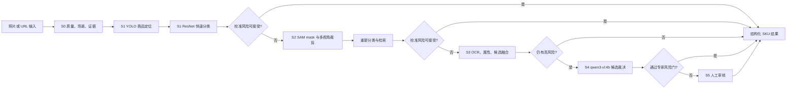
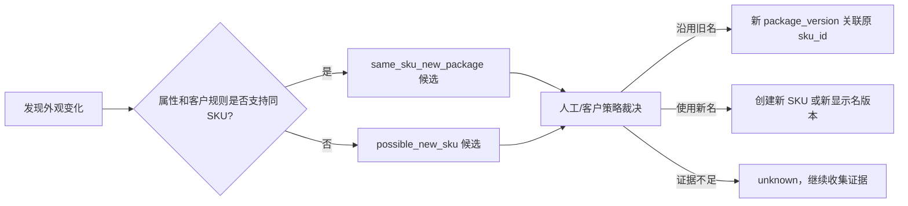

# Qwen3-VL 4B + Graph+Loop FMCG 多模型智能级联设计

> 文档日期：2026-08-06
> 文档状态：已获产品负责人批准，采用方案 B
> 文档性质：FMCG Vision Domain Pack 的 L1 架构规格
> 从属总纲：`docs/superpowers/specs/2026-08-04-fmcg-vision-saas-platform-design.md`
> 本地模型：`qwen3-vl:4b`
> 本阶段约束：本机 Apple M3 Max 128GB 优先；本文只定义方案，不代表已经实现、训练或发布

## 0. 结论

FMCG 识别采用方案 B：现有 Graph+Loop v2 作为唯一编排内核，YOLO、ResNet、SAM、OCR/检索、Qwen3-VL 和人工审核都注册为 Capability，由版本化策略根据客户档位、校准风险、SLA、预算和系统资源决定是否升级。

本设计不新建第二个 Orchestrator，不让四个模型全部常驻，不把 YOLO 检测置信度当作 SKU 最终置信度，也不让 Qwen 自由生成未经 SKU Registry 约束的商品名称。

Qwen3-VL 的定位是“沉睡的候选裁决器”：低层模型无法可靠判断时，结合区域图、场景上下文、OCR、属性和候选 SKU 做闭集重排序；发现新包装、疑似新 SKU 或证据不足时主动拒识并转人工。

## 1. 权威关系和边界

本文是统一平台总纲下的 FMCG 识别训练专项规格，不能覆盖以下上位规则：

- Graph+Loop 是系统核心，识别只是第一个 Domain Pack。
- 所有业务入口共用身份、权限、数据、证据、任务、用量、计费和审计底座。
- 原图、数据库、模型、数据集、审核、SAM、quality、eval、日志、备份和失败制品不得删除、覆盖或清理。
- 生产 bundle `prod_20260804_v4_r2` 保持冻结，模型训练完成不等于获准发布。
- Web、API 和 Agent 调用相同的领域能力和 Graph，不复制识别规则。
- Agent 不能获得任意 SQL、shell、文件系统或任意 Python import 权限。

本文取代“YOLO 快判 + SAM + ResNet + VLM 四个独立后端永久常驻”和“固定 0.85/0.65/0.4 置信度直接分流”的旧草案；旧草案只保留为讨论记录。

## 2. 2026-08-06 只读基线

### 2.1 代码和平台

| 项 | 当前事实 |
|---|---|
| 分支 | `feat/unified-workbench-training-readiness` |
| HEAD | `f0a7fd1` |
| Graph+Loop | v2 已有 typed edge、条件路由、feedback、轮次预算、人工门、持久检查点和决策轨迹 |
| 在线识别热路径 | `YOLO → 224x224 crop → ResNet18 → conf/margin 拒识` |
| SAM | 已用于标注框精修，但尚未进入在线识别热路径 |
| VLM/OCR 检索 | `src/pipeline/recognize.py` 有独立支线，尚未进入统一仲裁 |
| Qwen3-VL | Ollama 未安装 `qwen3-vl:4b`；主 Miniconda 环境无 `mlx/mlx_vlm/datasets/transformers` |
| 状态文档 | `STATUS.md` 仍写 training_started=false/NO-GO，与实际训练运行冲突 |
| 工作树制品 | `.quality/ .sam_checkpoints/ .sam_runs/ .superpowers/` 未跟踪，必须保留且不得误提交 |

### 2.2 当前 `sku_v7_sam` 实验

检查时进程正在以 MPS 训练：

```text
model=.models/sku_v4/weights/best.pt
data=.datasets/sam_refined_full_v1/data.yaml
epochs=120
patience=10
batch=4
imgsz=960
device=mps
optimizer=auto
```

已完成 28 epoch 的可复核事实：

| 指标 | 值 |
|---|---:|
| train / val 图片 | 8,732 / 834 |
| 总图片 | 9,566 |
| 类别 | 208 |
| 已用墙钟时间 | 约 19.5 小时 |
| 最佳 precision | 0.6104 @ epoch 23 |
| 最佳 recall | 0.6129 @ epoch 18 |
| 最佳 mAP50 | 0.6184 @ epoch 25 |
| 最佳 mAP50-95 | 0.3917 @ epoch 20 |
| 近况 | 综合最佳约在 epoch 20，检查时已有约 8 轮未创新高 |

本轮存在两项治理偏差：

1. Ultralytics 日志明确显示 `optimizer=auto` 忽略了指定的 `lr0=0.0005` 和 momentum，实际选择 MuSGD `lr=0.01`。
2. `docs/implementation/platform-v2/STATUS.md` 的 NO-GO/training_started=false 没有随着实际训练同步，运行事实和控制面事实不一致。

因此本轮只可标记为 `experimental`。允许其按 patience 自然停止并保留全部证据，但在同口径严格评估、数据审计和独立发布审批前不得进入生产。

### 2.3 当前质量和 SAM 数据

质量筛选事实：

| 项 | 数量 |
|---|---:|
| 输入文件 | 16,486 |
| SHA 唯一 | 10,510 |
| 重复 | 5,976 |
| accept | 9,566 |
| reject | 944 |
| tilt 原因 | 934 |
| blur 原因 | 12 |
| reflection 原因 | 0 |

SAM 精修约 243,324 个框，96.5% 通过几何约束。这个 96.5% 只表示“紧框满足程序几何条件”，不表示框是真实人工框，也不表示 SKU 类别正确。

新的三指标训练质量门与 qpol_v2 存在口径冲突：三指标门在水平线不足时把 tilt 设为 1.0 并自动 reject，而 qpol_v2 对缺失分析能力采用 waiting_human。934 张倾斜拒绝在人工金标准完成前不能作为已验证事实。

## 3. 两套层级必须分开

### 3.1 客户服务档位

客户购买的是准确率、时效、算力预算、人工服务和证据深度，不是购买某一个模型。

| 档位 | 名称 | 最大自动能力 | 典型时效 | 计费特点 |
|---|---|---|---|---|
| L | 快速 | 检测 + 快速分类 | 实时 | 单位价格最低，自动覆盖率和准确率承诺较低 |
| M | 标准 | 增加 SAM 精修和重新分类 | 近实时 | 增加分割算力和证据 |
| H | 深度 | 增加 OCR、检索、多视角融合 | 异步 | 按更多节点、队列和算力计费 |
| X | 专家 | 增加 Qwen3-VL 和人工兜底 | 高准确率 SLA | 计入 VLM token、冷启动、人工和高级证据 |

客户档位决定 GraphPolicy 的最大阶段、预算、SLA 和人工策略，但不能绕过质量、安全和合规门禁。

### 3.2 内部推理阶段

| 阶段 | 能力 | 责任 | 不负责什么 |
|---|---|---|---|
| S0 | 质量/场景/证据 | 判定照片是否可处理、保留质量证据 | 不判断 SKU |
| S1 | YOLO + ResNet | 商品定位、快速 SKU 候选和拒识 | YOLO 类别不拥有最终 SKU 决策权 |
| S2 | SAM + ResNet/检索 | 生成干净 mask、多视角 crop、重新分类 | SAM 不产生 SKU 语义 |
| S3 | OCR + 属性 + 向量检索 | 读取包装文字、生成闭集候选、发现硬冲突 | 不自由创建 SKU |
| S4 | Qwen3-VL 4B | 结合上下文和候选做裁决、识别新包装/未知 | 不自由生成生产主数据 |
| S5 | 人工审核 | 最终裁决、错标/漏标/新包装/新 SKU 处理 | 不覆盖历史证据 |

内部阶段和客户档位不能使用同一套 Level 编号，避免未来定价变化破坏模型编排。

## 4. 目标架构



Graph+Loop 是唯一编排者。各模型只提供能力，不得在模型服务内部偷偷调用下一层或自行决定客户计费。

## 5. Capability 设计

建议注册以下能力 ID：

| Capability ID | 输入 | 输出 |
|---|---|---|
| `vision.quality.assess.v2` | AssetRef、策略版本 | QualityEnvelope |
| `vision.scene.classify.v1` | AssetRef | SceneEnvelope |
| `vision.detect.product.v1` | AssetRef、检测策略 | DetectionEnvelope |
| `vision.classify.sku.fast.v1` | RegionRef、候选域 | PredictionEnvelope |
| `vision.segment.refine.sam.v1` | RegionRef、point/box prompt | SegmentationEnvelope |
| `vision.retrieve.sku.v1` | crop、OCR、属性 | CandidateSet |
| `vision.vlm.qwen3vl4b.rerank.v1` | ContextBundle、CandidateSet | PredictionEnvelope |
| `vision.human.review.v1` | ReviewTask | HumanDecision |

保留 `legacy.recognition.v2` 作为兼容适配器。新 Graph 不直接 import `src.cascade`、`src.pipeline` 或 MLX 服务，只通过 CapabilityRegistry 获取能力。

### 5.1 PredictionEnvelope

所有识别阶段使用统一输出，不再让每个模型自定义结果：

```json
{
  "schema_version": "prediction-envelope.v1",
  "prediction_id": "uuid",
  "run_id": "uuid",
  "asset_id": "asset-id",
  "region_id": "region-id",
  "stage": "S1",
  "model_id": "resnet18",
  "model_version": "sha256-or-bundle-version",
  "registry_version": "sku-registry-version",
  "policy_version": "cascade-policy-version",
  "topk": [
    {"sku_id": "SKU-001", "score": 0.71}
  ],
  "signals": {
    "top1": 0.71,
    "margin": 0.09,
    "entropy": 1.13,
    "ocr_conflicts": []
  },
  "calibrated_risk": 0.08,
  "decision": "accepted",
  "abstain_reason": null,
  "latency_ms": 32.4,
  "usage": {"unit": "region", "quantity": 1},
  "evidence_ids": []
}
```

`score` 是模型原始分，`calibrated_risk` 才能用于跨模型路由。缺少校准版本、输入证据或模型版本时必须 fail-closed。

## 6. 风险校准和路由

禁止直接使用固定的 YOLO/ResNet/VLM 置信度区间作为全局路由。

统一风险至少考虑：

- 检测框稳定性、重复框和边界截断；
- ResNet top1、top1-top2 margin、entropy；
- SAM mask stability、IoU、面积和 crop 变化；
- OCR 的品牌、口味、糖度、容量硬冲突；
- 检索 top-k 间隔；
- OOD/未知商品、新包装概率；
- 图像质量、场景和遮挡；
- 当前档位、SLA、剩余预算和资源状态。

路由策略示例：

```text
accept(S1)       := risk_s1 <= policy.fast_accept_risk
escalate(S2)     := risk_s1 > fast_accept_risk and policy.max_stage >= S2
escalate(S3)     := risk_s2 > medium_accept_risk and policy.max_stage >= S3
escalate(S4)     := hard_conflict or risk_s3 > deep_accept_risk
human            := risk_s4 > expert_accept_risk or unknown/new_package
budget_exhausted := stop with explicit partial/needs_review result
```

阈值必须来自冻结校准集的 coverage-risk 曲线，版本化并按客户策略引用。没有校准证据时不得把原始 softmax 当概率承诺。

## 7. Apple 模型驻留和资源管理

M3 Max 使用统一内存，CPU、MPS 和模型共享资源。四个大模型全部常驻会放大 swap、热限制和服务抖动。

采用三态模型驻留：

| 状态 | 模型 | 规则 |
|---|---|---|
| hot | YOLO、ResNet、轻量检索 | 在线服务常驻；必须有内存和吞吐上限 |
| warm | SAM Hiera Small | 有 S2 队列时加载；短 TTL 复用 |
| cold | Qwen3-VL 4B | 有 S4 批次才加载；空闲 TTL 后卸载；初期并发 1 |

ModelResidencyManager 必须记录 load/unload、模型哈希、内存、队列、冷启动和失败原因。VLM 不可用时 Graph 根据客户 SLA 转人工或输出 pending，禁止静默跳过。

硬停止线：

- 当前 YOLO 训练没有停止前，不启动 Qwen 微调；
- swap 高于批准停止线时不开始新训练；
- MPS 不可用、出现 CPU fallback、NaN/Inf、热限制或内存持续增长时停止；
- 8091/8092/8400 的健康策略由执行手册明确，不以“进程存在”冒充健康；
- 不使用 `--use-mps` 伪参数，MLX 在 Apple Silicon 上原生使用 Metal。

## 8. Qwen3-VL 4B 模型映射

| 用途 | 标识 |
|---|---|
| 业务逻辑模型名 | `qwen3-vl:4b` |
| Capability | `vision.vlm.qwen3vl4b.rerank.v1` |
| 官方基础权重 | `Qwen/Qwen3-VL-4B-Instruct` |
| Apple QLoRA 首选权重 | `mlx-community/Qwen3-VL-4B-Instruct-4bit` |
| 定制 adapter | `qwen3vl4b-fmcg-rerank-v1.safetensors` |
| 初期服务 | MLX-VLM Server + adapter |
| 后续 Ollama 名称 | `qwen3-vl:4b-fmcg-v1`，仅在转换一致性验证后启用 |

Ollama 的 `qwen3-vl:4b` 是 Q4_K_M 推理制品，不是 MLX LoRA 训练输入。第一版不得把 MLX adapter 直接宣称为 Ollama 可用；需要先完成 merge/convert、视觉投影组件兼容和冻结样本一致性验证。

参考：

- https://huggingface.co/Qwen/Qwen3-VL-4B-Instruct
- https://github.com/QwenLM/Qwen3-VL
- https://github.com/Blaizzy/mlx-vlm/blob/main/mlx_vlm/LORA.MD
- https://huggingface.co/mlx-community/Qwen3-VL-4B-Instruct-4bit
- https://ollama.com/library/qwen3-vl%3A4b

## 9. Qwen 任务设计

Qwen 不训练成“看区域后自由输出商品名称”的开放生成器。训练目标包含四类：

1. 候选 SKU 重排序：给定 region、上下文、OCR、属性和 Top-K SKU，输出一个 registry SKU 或 unknown。
2. 属性核验：品牌、产品、口味、糖度、容量、包装规格逐项判断。
3. 包装演化判断：区分同 SKU 新包装、疑似新 SKU、旧包装延续和证据不足。
4. 主动拒识：模糊、遮挡、多个商品混入、候选硬冲突时输出 abstain。

结构化输出：

```json
{
  "schema_version": "qwen-sku-decision.v1",
  "decision": "accepted|unknown|same_sku_new_package|possible_new_sku|insufficient_evidence",
  "sku_id": "SKU-001|null",
  "package_version_id": "PKG-001|null",
  "candidate_id": "SKU-001|null",
  "attributes": {
    "brand": "string|null",
    "product": "string|null",
    "flavor": "string|null",
    "sugar": "string|null",
    "volume_ml": "number|null"
  },
  "conflicts": [],
  "evidence": [],
  "abstain_reason": "string|null"
}
```

服务端必须用 JSON Schema 校验输出。非法 JSON、registry 不存在的 SKU、候选集外 SKU 或属性硬冲突一律不得 accepted。

## 10. 数据设计

### 10.1 全照片不等于全训练

所有样板照片、文件输入和 URL 下载结果都必须进入资产台账、质量证据和用途判定；只有满足训练用途的资产进入训练快照。

以下数据不得进入正式训练：

- frozen calibration/dev/diagnostic/gold；
- SHA 或近重复跨 split；
- 门店、session、客户、时间或包装版本泄漏；
- quality reject；
- manual_pending；
- 未裁决的模型 prediction；
- SKU Registry 无法映射的自由名称；
- 只有 SAM 几何通过、但类别来源不可信的样本。

### 10.2 Canonical VLM Sample

```json
{
  "sample_id": "uuid",
  "asset_id": "asset-id",
  "photo_sha256": "sha256",
  "image_uri": "cas://sha256",
  "region": {"bbox_1000": [100, 200, 400, 800], "point_1000": [250, 500]},
  "crop_asset_id": "crop-id",
  "context_asset_id": "context-id",
  "mask_asset_id": "mask-id|null",
  "sku_id": "SKU-001|null",
  "package_version_id": "PKG-001|null",
  "target_type": "closed_set|unknown|new_package|hard_negative",
  "label_source": "human_final|gold_verified|sam_geometry_verified|model_provisional",
  "sample_weight": 1.0,
  "registry_version": "v1",
  "quality_policy_version": "qpol_v2",
  "split_group": {
    "customer": "...",
    "store": "...",
    "session": "...",
    "near_dup_group": "...",
    "package_version": "..."
  },
  "evidence_ids": []
}
```

项目可保留 JSONL 作为不可变清单和审计入口，但 MLX-VLM 训练制品必须转换为 Hugging Face Dataset 的 `images` 和 `messages` 列。消息由 processor/chat template 处理，禁止手工硬编码 `<|vision_start|>`。

Qwen3-VL 的 bbox 使用 0–1000 相对坐标，并同时保存原图宽高和原像素坐标，避免转换不可追溯。

### 10.3 样本组成

第一版建议：

- 60% region crop，保留 10%–20% 上下文；
- 25% 原始大图 + bbox/point 指引；
- 10% 高相似 SKU 难负例和 Top-K 重排序；
- 5% unknown、新包装、价签、空框、反光、遮挡、背景和多商品混入。

同一张货架大图可产生多个区域实例，但不得为每个框无节制复制最高分辨率全图。构建器必须报告图片数、区域数、视觉 token 估算、每类数量和磁盘放大倍数。

### 10.4 split

不使用随机 9:1。必须按 customer/store/session/time/package_version/near_dup_group 做 group split，并保护所有 active protocol。建议 train/val/test 约 80/10/10，但最终比例由可用隔离组决定，不为凑比例破坏隔离。

## 11. QLoRA 训练阶梯

### Gate V0：环境和零样本

- 单独创建隔离的 MLX-VLM 环境，不污染主 Miniconda 识别/YOLO 环境；
- 锁定 Python、mlx、mlx-vlm、datasets、模型 revision 和哈希；
- 运行 Qwen3-VL 4B Instruct 零样本冻结评估；
- 记录单图/单区域 tokens/s、峰值内存、swap、冷启动和输出合规率。

### Gate V1：格式和可学习性

- 32 条 overfit 测试；
- 128 条端到端 dataset smoke；
- JSON Schema 合规率 100%；
- registry 越界 accepted 为 0；
- 数据泄漏为 0。

### Gate V2：Apple 吞吐探针

用 200–500 step 比较 batch 1/2/4、图像尺寸/视觉 token 上限、BF16 LoRA 与 4-bit QLoRA。只有内存、swap、热状态、loss 和系统服务均稳定，才提高 batch。

### Gate V3：第一轮 pilot

第一轮使用 5,000–20,000 个区域实例：

```text
model: mlx-community/Qwen3-VL-4B-Instruct-4bit
method: QLoRA
lora_rank: 16
lora_alpha: 32
batch_size: 2 起步
gradient_accumulation_steps: 4–8
train_on_completions: true
train_vision: false
epochs: 1 起步
learning_rate candidates: 5e-5 / 1e-4 / 2e-4
```

每次实验只改一个主变量。第一轮不承诺 batch 16、10 epoch 或 3–5 小时。

### Gate V4：扩大或视觉模块实验

只有 V3 在冻结集上超过零样本和现有级联，且 false accept、unknown、新包装和成本门禁同时通过，才扩大数据量。语言侧会重排但看不清细粒度包装时，才单独实验 `train_vision=true`，使用更低学习率和更小 batch。

### Gate V5：候选发布

训练结果先进入 shadow candidate。必须通过独立发布审批，且不自动切换 `prod_20260804_v4_r2`。

## 12. 新包装和商品主数据

Qwen 只能提出包装演化候选，不能直接改 SKU 主数据。



所有裁决保存旧包装、新包装、客户规则、模型输出、人工决定和生效时间。

## 13. 队列、SLA 和人工兜底

12 小时和 48 小时是业务队列 SLA，不是模型单次计算超时。

每阶段需要两个时间概念：

- `attempt_timeout`：单次模型调用秒级或分钟级上限；
- `queue_deadline`：客户任务在 12/48 小时内必须完成、降级或转人工。

任务状态至少包含 queued/running/waiting_resource/waiting_human/succeeded/failed/expired/cancelled。重试使用稳定幂等键，不能重复计费或重复写结果。

人工审核界面必须看到：原图、区域、所有 crop/mask、各阶段 Top-K、OCR、属性冲突、风险、升级原因、模型版本和证据链。

## 14. 计费

UsageEvent 追加记录：

- tenant/customer/project；
- graph/run/node/attempt；
- customer tier；
- capability/model/version；
- photo/region/call/token/compute_ms；
- cold_start、cache_hit；
- human_review；
- rate_card_version；
- estimated_cost 和 finalized_cost 状态。

初期按模块化成本汇总，后台成本稳定后折算平台 token。失败重试是否收费由 RateCardPolicy 决定，但账本必须记录实际资源消耗和客户计费结果两者，不能混成一个字段。

## 15. Web 和 API

统一管理界面新增“智能级联”视图，而不是新开独立后台：

- 实时任务：当前档位、阶段、风险、下一节点、SLA、预算；
- 模型运行：hot/warm/cold、内存、队列、加载时间、错误；
- 识别详情：区域级 stage trail、候选和证据；
- Qwen 训练：数据快照、门禁、参数、loss、tokens/s、内存、adapter；
- 新包装：同 SKU 新包装、疑似新 SKU、待客户裁决；
- 人工审核：统一接 Label Studio 或平台原生审核任务。

API、Web 和内部 Agent 都只能提交同一种 RecognitionTask/GraphRun。API 不暴露服务器文件路径、任意模型名或任意 prompt。

## 16. 评估和承诺

“综合准确率 >95%”必须拆成可审计指标：

| 指标 | 要求 |
|---|---|
| accepted precision | 专家档目标 ≥95%，按冻结客户集报告 |
| auto coverage | 必须同时报告，禁止靠大量拒识制造高准确率 |
| detector | recall@固定 FP/photo、IoU0.50/0.75、重复框和背景误检 |
| classification | Top-1、Top-5、属性精确率、相似 SKU 混淆 |
| unknown/new package | recall、precision、false accept |
| end-to-end | 区域级和照片级；计数误差；每照片 FP/FN |
| efficiency | 每阶段 p50/p95、tokens/s、冷启动、每千实例成本 |
| operations | 人工回退率、超 SLA、队列积压、失败恢复 |

200 张测试只能作为 smoke，不足以单独支持商业准确率承诺。最终冻结集按实例、门店、客户、时间和包装版本分层，并给出置信区间。

## 17. 兼容和迁移

第一阶段采取旁路 shadow：

1. 保持 8091 `legacy.recognition.v2` 和生产 bundle 不变。
2. 新能力先在 Graph+Loop 中对相同任务影子运行，不返回给生产客户。
3. 对比现有结果、新级联结果、人工金标准、延迟和成本。
4. 只有风险和收益门禁通过，才允许某个客户档位进入 canary。
5. 任何回滚只切策略版本，不删除模型、adapter、结果或证据。

## 18. 明确拒绝的做法

- 四个模型后端全部永久常驻；
- 把 YOLO 检测置信度直接当 SKU 最终置信度；
- 认为 SAM 自身能够识别 SKU；
- 用单一 0.85/0.65/0.4 阈值跨模型分流；
- Qwen 自由输出商品名称并直接写 SKU 主数据；
- 随机 9:1 split；
- 手工拼接 Qwen vision special token；
- 直接对 Ollama Q4_K_M 制品执行 MLX LoRA；
- 无基准就 batch 16、10 epoch；
- 用 48 小时作为单次 VLM 推理超时；
- 训练完成自动发布；
- 为新级联另建平行 Orchestrator、数据库、计费或审核系统。

## 19. 实施退出标准

方案实现完成至少需要：

1. 新能力全部经 CapabilityRegistry 注册，平台内核无 Domain Pack 反向 import。
2. PredictionEnvelope、CandidateSet、RiskDecision 和 UsageEvent 契约测试通过。
3. S0–S5 Graph 可暂停、恢复、预算停止、转人工并重放决策轨迹。
4. Qwen 环境隔离，Apple 基准和停止线有机器证据。
5. 数据快照无 active protocol、SHA、近重复、门店、session、客户和包装版本泄漏。
6. Qwen 输出 schema 合规率 100%，registry 越界 accepted 为 0。
7. 客户四档策略、最大阶段、SLA 和计费可配置且有测试。
8. shadow 评估同时报告准确率、覆盖率、延迟、成本和人工率。
9. 当前 `sku_v7_sam` 被诚实标注为 experimental，状态文档与进程/制品一致。
10. 未经独立授权不切换生产 bundle。

## 20. 下一份文档

实施任务、文件结构、TDD 顺序、Apple 训练门禁、验收命令和可直接交给 Agent 的提示词见：

`docs/superpowers/plans/2026-08-06-qwen3-vl-4b-graph-loop-cascade-implementation-plan.md`
