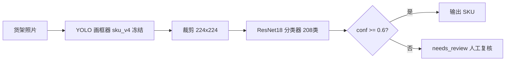

# 训练历史全记录：轮次参数、问题与架构演进

> 截止 2026-08-01 的历史决策记录。sku_v6 phase2 训练已暂停（当时按手册认为 20 个 ISSUE 已全部修复，见
> [`project-issue-register-and-remediation.md`](./project-issue-register-and-remediation.md)）。
> 2026-08-04 二次复核发现整改代码、自动化测试、当前制品和在线状态并未全部闭环；最新结论以 [`latest-handbook-reverification-2026-08-04.md`](./latest-handbook-reverification-2026-08-04.md) 为准。本文记录历史演进，不作为当前关闭证明。
> 本文档供重新评估训练路线使用。所有数字均来自 `.models/*/train_meta.json`、`results.csv`、
> `training_history.json` 与历次穿透测试的实测记录。

---

## 1. 当前架构：级联识别（Cascade）

- **分工决策**：YOLO 只负责"画框定位"，细粒度 SKU 判别交给分类器。
- **失败关闭**：在线服务权重缺失/类别不匹配时报错拒绝服务，禁止回退 COCO 通用模型（ISSUE-002/003 已修复）。
- **目标**：端到端 SKU 准确率 95%+；当前实测 20.8%（修复抠图不匹配前的数字，瓶颈分析见 §4）。

---

## 2. YOLO 检测器训练轮次（208 SKU）

| 轮次 | 起点权重 | epochs | imgsz | batch | cls权重 | lr0 | 数据集 | mAP50 结果 | 备注 |
|---|---|---|---|---|---|---|---|---|---|
| sku_v1 | yolo26m（预训练） | 80 | 640 | 8 | 0.5 | 默认 | 批1：2653/294 | **0.405** | 基线链路打通 |
| sku_v2 | yolo26m | 120 | 960 | 4 | 0.8 | 默认 | 批1 | **0.299 ↓** | 失败轮：提分辨率+cls 反而退化 |
| sku_v3 | yolo26m | 120 | 960 | 4 | 0.8 | 默认 | 批1 | **0.4387** | 重跑修正，小幅超 v1 |
| sku_v4 | **sku_v3 best.pt 续训** | 120 | 960 | 4 | **1.0** | 默认 | 批1 | **0.6887 ↑↑** | 关键跃升：渐进式续训+强化分类损失 |
| sku_v5 | sku_v4 best.pt 续训 | 120 | 960 | 4 | 1.2 | 5e-4 | **批2混合：5976/534** | **0.6897** | +cos_lr/dropout0.15/mixup0.3；新数据仅 +0.001 |
| sku_v6 phase1 | sku_v4 best.pt 续训 | 50(计划) | **1024** | 4 | **0.2** | 1e-4 | 批3清洗4000+旧5976，灰名单降采样 | ep6 存档中断 | 召回专项：弱化分类、强化定位 |
| sku_v6 phase2 | **sku_v6_ep6.pt 续训** | 44 | 1024 | 4 | 0.2 | **1e-5** | 同 phase1 | **暂停中** | 方案A+C：任意框定位专项 |

### YOLO 线关键观察

1. **v2 退化（0.405→0.299）**：imgsz 960 + cls 0.8 组合从零训练不收敛；v3 同参数重跑恢复到 0.439，说明该轮有执行层面的偶发问题而非参数本身错误。
2. **v4 是最大跃升（+0.25 mAP50）**：验证了调优方法论——"旧模型表现良好时基于 best.pt 渐进续训 + 针对性提升 cls 权重（同类不同规格误判场景）"。
3. **v5 新数据收益极低（+0.001）**：5976 张混合数据 + 全套正则化只换来 0.001，说明批2数据对整体 mAP 已近饱和，瓶颈转移到难例 SKU。
4. **v4 被冻结作画框器**（mAP50=0.6887），v5 权重保留但线上未采用。

---

## 3. 级联分类器训练轮次（ResNet18，208 类，裁剪 224）

| 轮次 | 裁剪来源 | 起点 | epochs | 最佳 val_acc | 结果 |
|---|---|---|---|---|---|
| 分类器 R1 | **GT 启发式框**（sku_box_frac） | ResNet18 从零 | 80 | **92.95% @ ep71** | ep71 达峰后平台化；过拟合（train 97.2% vs val 92.9%，差 4.3%） |
| 分类器 R2（抠图修复） | **YOLO 预测框**（build_yolo_crop_dataset） | R1 best.pt 微调 | 15 | **83.67% @ ep10** | YOLO 框验证集；首轮即 80.5%，ep10 达峰后平台 |

### 分类器线关键观察

1. **R1 独立指标虚高**：92.95% 是在 GT 框裁剪上测的；真实推理链路收到的是 YOLO 框裁剪，级联中实际分类准确率只有 **60.4%**——训练/推理抠图不匹配（详见 §4 问题 #1）。
2. **R2 修复后**：用 YOLO 实际预测框重新裁剪训练（conf=0.15，标签取框内匹配 GT），val_acc 从级联实测 60.4% 拉回 83.67%（YOLO 框验证集口径）。
3. **数据工程缺陷**：R2 裁剪数据集曾出现文件名碰撞（汇总 65,648 vs 磁盘 64,087，差 1,561），已在 ISSUE-013 修复（框序号+坐标哈希命名、staging 全新构建、磁盘核对）。
4. R1 权重备份在 `.models/classifier/best_gtbox_backup.pt`，当前线上 `best.pt` 为 YOLO 框版本。

---

## 4. 遇到的核心问题（按时间顺序）

### #1 抠图不匹配：分类器 92.95% → 级联 60.4%（最严重）
- **现象**：端到端集成测试，分类器独立 92.95%，但级联中只有 60.4%。
- **根因**：训练用 GT 启发式框裁剪，推理用 YOLO 预测框裁剪，尺寸/构图分布不同。
- **处置**：用 YOLO 预测框重建裁剪数据集重训（R2），级联分类准确率回到 83.67%。

### #2 YOLO 检测召回瓶颈：端到端仅 20.8%
- **现象**：集成测试端到端 SKU 准确率 20.8%，YOLO 漏检 65.6% 的目标（检测召回 34.4%）。
- **最差 SKU**（修复前）：美橙600ml 覆盖召回 9.7%、拉罐330ml 10%、芬达橙500ml 16.7%、百事600ml 18.7%。
- **处置**：启动 sku_v6 召回专项（imgsz 640→1024、cls 弱化到 0.2、补批3清洗数据 4000 张、灰名单降采样）。

### #3 难例"会画框、不会分类"——架构天花板
- **现象**（sku_v6 ep6 穿透测试，200-300 张真实货架照）：难例**同类检测召回**仍只有 0.7~14.7%（未达 50% 门槛），但**任意框定位召回**已达 20~54%：

| SKU | 基线任意框 | ep6 任意框 | 解读 |
|---|---|---|---|
| 美橙600ml | 21.6% | **34.5%** ↑ | 定位在学 |
| 1L美年达 | 52.0% | **53.9%** | 定位已会 |
| 芬达橙500ml | 19.7% | **21.1%** | 定位部分 |
| 拉罐330ml | — | 20.2% | 定位部分 |
| 百事600ml | — | 20.1% | 定位部分 |

- **结论**：YOLO 能框住难例但分类成相似 SKU（容量混淆：1L百事→2L百事；口味混淆：佳得乐柠檬→蓝莓），继续考核"同类命中"没有意义。
- **处置（方案 A+C）**：终止同类命中率考核，YOLO 唯一指标改为**任意框定位召回率 >60%**；lr 从 1e-4 降到 1e-5 续训（phase2），分类混淆交给级联分类器。

### #4 分类器平台化与过拟合
- R1 在 88% 平台化后通过继续训练爬到 92.95%（ep71），但 train-val 差 4.3%，存在记忆化。
- R2 在 83.67%（ep10）平台化，15 轮后未再提升。
- **待办**：突破 94% 目标需诊断（骨干升级 EfficientNet-B0 / 难例增强 / 冻结骨干低温微调分类头）。

### #5 数据质量问题
- 批3原始照片存在模糊/反光/翻拍 → 部署 OpenCV 图像质量拦截器（Laplacian 模糊检测、HSV 反光面积比、摩尔纹检测；因含 330ml 小拉罐微距目标放宽了模糊阈值），清洗出约 4000 张合格图（`.batch3_clean/gate_results.json`）。
- 灰名单（标注可疑/低频类）SKU 做降采样，避免污染分布。

### #6 训练工程问题（当时的修复判断；最新复核未全部关闭）
| 问题 | 影响 | 修复 |
|---|---|---|
| 复训未把导出数据集传给 train（ISSUE-001） | 可能用错数据集静默训练 | 显式 data_yaml + 训练前校验（路径/类别/样本数/哈希） |
| 权重可被覆盖、无不可变快照（ISSUE-006） | 模型版本不可追溯 | SHA-256 命名只读仓库 `.models/registry/` |
| 裁剪数据集文件名碰撞（ISSUE-013） | 1,561 个样本被覆盖/残留 | 框序号+坐标哈希命名 + staging 全新构建 + 磁盘核对 |
| 审计写入静默丢失（ISSUE-007） | 识别记录缺失 | SQLite WAL + UUID run_id + 失败显式标注 |
| 监控服务反复挂（launchd 因 TCC 无权访问 ~/Documents） | 训练不可见 | 用户态看门狗 `scripts/monitor_watchdog.sh` 守护 :8092 |
| 其余 15 项（鉴权/CORS/SSRF/凭据/迁移/XSS 等） | 平台安全与数据正确性 | 当时记录为“全部已修复并回归”；二次复核后须按最新报告逐项判断 |

---

## 5. 关键评测数据汇总

| 指标 | 数值 | 时点 |
|---|---|---|
| YOLO 最佳 mAP50 | 0.6897（sku_v5）/ 线上冻结 sku_v4 0.6887 | v5 完成 |
| 端到端 SKU 准确率 | **20.8%**（修复抠图前） | 集成测试 R1 |
| YOLO 检测召回 | 34.4%（漏检 65.6%） | 同上 |
| 级联分类准确率 | 60.4% → 83.67%（抠图修复后 YOLO 框口径） | R2 |
| 分类器独立 val_acc | 92.95%（GT 框口径，虚高） | R1 ep71 |
| 难例任意框定位召回（ep6） | 20.2% ~ 53.9%，目标 >60% | Gate 穿透测试 |
| 难例同类召回（ep6） | 0.7% ~ 14.7%（已放弃考核） | Gate 穿透测试 |

---

## 6. 当前状态与待决策点

### 现状
- sku_v6 phase2（lr 1e-5、44 轮、从 sku_v6_ep6.pt 续训）**已暂停**；phase1 权重备份在 `.models/sku_v6_p1/`。
- 全部工程 bug 已修复并通过回归（22 项测试 + 11 项冒烟），训练前置校验已生效（恢复训练时会先跑数据集校验）。
- 修复前基线哈希清单：`.platform/baseline_hashes.json`（11 项权重/库/配置）。

### 待你决策的问题
1. **是否恢复 sku_v6 phase2？** 既定计划：跑到总 Epoch ~15 做穿透测试——
   - ✅ 任意框定位召回突破 60%（尤其美橙 34.5%→60%+）→ YOLO 定位任务完成，跑完剩余轮次后冻结；
   - ❌ 仍无增长 → 放弃 YOLO 微调，切**方案 B**：难例完全交给级联分类器。
2. **YOLO 继续投入是否值得？** 备选：接受当前召回，把精力全部转向分类器（升级骨干/难例增量微调闭环，10-20 分钟一轮的快速迭代模式）。
3. **分类器下一步**：83.67% 平台化，距 94% 目标差距 10+ 点；选项：EfficientNet-B0 骨干、难例增强、低温微调分类头抗过拟合。
4. **数据侧**：是否需要继续补难例 SKU 实拍（美橙/拉罐/芬达），还是用现有数据把模型潜力榨干。

### 恢复训练注意事项（供参考）
- `train_v1.py` 现已强制训练前数据集校验（ISSUE-001），恢复时直接传原 data.yaml 即可，校验会自动执行。
- 监控看门狗与训练并行无冲突；phase2 断点权重为 `.models/sku_v6_ep6.pt`。
